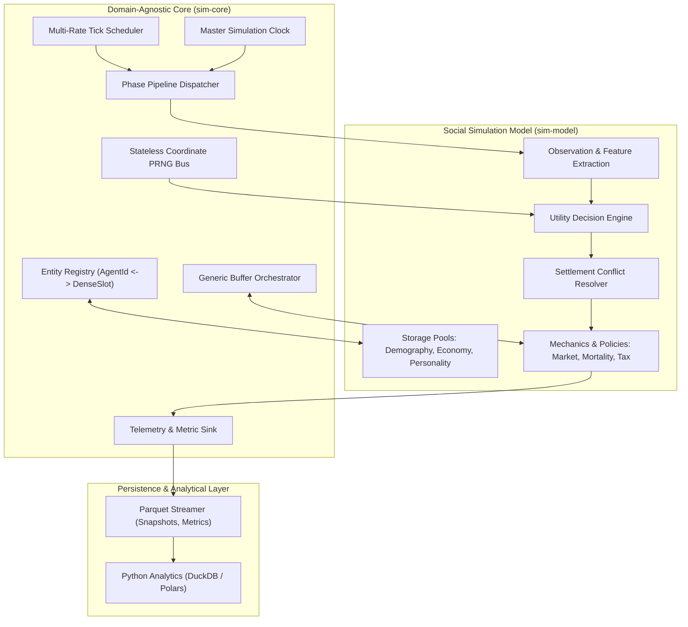
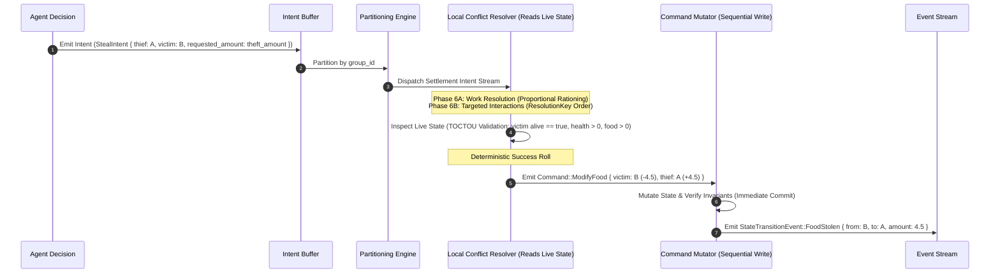
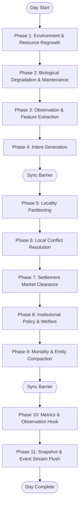
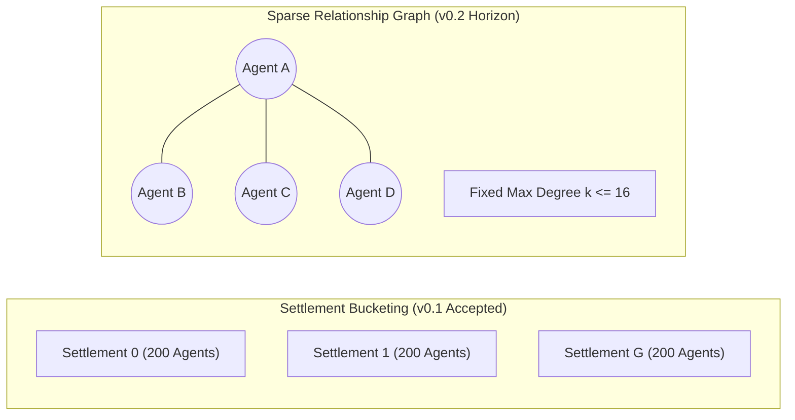

# SimulaCiv: Architecture and Technical Design Specification
**A High-Performance, Deterministic, Agent-Based Social Simulation Engine**

- **Target Implementation Core:** Rust (`sim-core`, `sim-model`) / Python (Experimentation & Analytics)
- **Status:** Working Draft / Pre-Implementation

---

## Executive Summary & Engineering Doctrine

SimulaCiv is an exploratory, high-performance agent-based computational engine designed to model emergent socio-economic dynamics across populations exceeding 100,000 agents over multi-year simulated horizons. 

This document defines the formal architectural contracts, data structures, execution pipelines, and validation criteria for the engine. It establishes a phased implementation methodology:
1. **M0 — Reference Model**: A minimal, single-threaded, mechanically transparent reference simulation acting as the executable semantic oracle.
2. **M1 — Contract Freeze**: Formal locking of all architectural, operational, and data exchange contracts (C01–C10) based on validated M0 semantics.
3. **M2 — High-Performance Runtime**: A vectorized, cache-conscious, data-parallel runtime executing under Segmented Structure-of-Arrays (SoA), verified against M0 via automated differential testing.

```
+-----------------------------------------------------------------------------------+
|                               SIMULACIV STACK                                     |
+-----------------------------------------------------------------------------------+
|  [Analysis & Experimentation Layer]                                               |
|  Python (Polars, DuckDB, Jupyter, SciPy)                                          |
+-----------------------------------------------------------------------------------+
                                  ^                  ^
                  Parquet Snapshots                  Parquet Metrics / Telemetry
                                  |                  |
+-----------------------------------------------------------------------------------+
|  [Batch Experiment Runner & Orchestrator]                                         |
|  Rust CLI / Thread-Pool Worker Orbits (Parameter Sweeps, Seed Distribution)       |
+-----------------------------------------------------------------------------------+
                                  |
                                  v
+-----------------------------------------------------------------------------------+
|  [Simulation Model Layer (sim-model)]                                             |
|  * Domain Storages: Demography, Economy, Personality, Spatial Buckets             |
|  * Domain Contracts: Intents, Commands (TransferWealth, ModifyFood), Events       |
|  * Pluggable Modules: Production, Market Clearing, Crime, Tax, Welfare            |
+-----------------------------------------------------------------------------------+
                                  |
                                  v
+-----------------------------------------------------------------------------------+
|  [Domain-Agnostic Core Engine (sim-core)]                                         |
|  * Master Clock & Multi-Rate Phase Dispatcher                                     |
|  * Stable Entity Identity & DenseSlot Indirection Registry                        |
|  * Stateless Counter-Based Coordinate PRNG Bus                                    |
|  * Generic Buffer Orchestration & Telemetry Plumbing                              |
+-----------------------------------------------------------------------------------+
```

---

## Table of Contents

1. [Project Purpose & Scope](#1-project-purpose--scope)
2. [Core Requirements, Constraints & Performance Targets](#2-core-requirements-constraints--performance-targets)
3. [Non-Goals](#3-non-goals)
4. [Modeling Philosophy & Epistemology](#4-modeling-philosophy--epistemology)
5. [Development Methodology: The M0 / M1 / M2 Phases & Reference Oracle](#5-development-methodology-the-m0--m1--m2-phases--reference-oracle)
6. [v0.1 Model Scope & Baseline Experiment](#6-v01-model-scope--baseline-experiment)
7. [Overall System Architecture & Core/Model Boundary](#7-overall-system-architecture--coremodel-boundary)
8. [Core Engine Responsibilities & Domain-Agnostic Primitives](#8-core-engine-responsibilities--domain-agnostic-primitives)
9. [State, Model, and System Separation](#9-state-model-and-system-separation)
10. [Core Contract Specifications (C01 – C10)](#10-core-contract-specifications-c01--c10)
11. [Command, Intent, and Localized Conflict Resolution Architecture](#11-command-intent-and-localized-conflict-resolution-architecture)
12. [Agent Decision Architecture & Normalized Feature Extraction](#12-agent-decision-architecture--normalized-feature-extraction)
13. [Simulation Tick & Day Lifecycle](#13-simulation-tick--day-lifecycle)
14. [Data-Oriented Storage Architecture (Stable AgentId vs. DenseSlot)](#14-data-oriented-storage-architecture-stable-agentid-vs-denseslot)
15. [Relationship & Interaction Topologies ($O(N^2)$ Avoidance)](#15-relationship--interaction-topologies-on2-avoidance)
16. [Multi-Rate Scheduler & Discrete Event Engine](#16-multi-rate-scheduler--discrete-event-engine)
17. [RNG Logical Addressing & Determinism Specification](#17-rng-logical-addressing--determinism-specification)
18. [Batch Experiment Runner & Parameter Sweeps](#18-batch-experiment-runner--parameter-sweeps)
19. [Storage Strategy: Canonical Hashes, Snapshots, and Parquet Output](#19-storage-strategy-canonical-hashes-snapshots-and-parquet-output)
20. [Analytics & Post-Processing Pipeline](#20-analytics--post-processing-pipeline)
21. [Performance Strategy & Computational Budget Categorization](#21-performance-strategy--computational-budget-categorization)
22. [Parallelization Strategy & Partitioned Synchronization](#22-parallelization-strategy--partitioned-synchronization)
23. [Benchmarking, Profiling & Scaling Test Strategy](#23-benchmarking-profiling--scaling-test-strategy)
24. [Configuration Management & Validation](#24-configuration-management--validation)
25. [Error Handling, Conservation Laws & Invariant Enforcement](#25-error-handling-conservation-laws--invariant-enforcement)
26. [Testing Strategy: Tiered Hierarchy & Differential Testing](#26-testing-strategy-tiered-hierarchy--differential-testing)
27. [Model Validation: Mechanical Invariants vs. Research Hypotheses](#27-model-validation-mechanical-invariants-vs-research-hypotheses)
28. [Debugging, Tracing & Observer Independence](#28-debugging-tracing--observer-independence)
29. [Future Expansion Strategy & Modular Roadmaps](#29-future-expansion-strategy--modular-roadmaps)
30. [Evolutionary Roadmap (v0.1 -> v0.2 -> v1.0)](#30-evolutionary-roadmap-v01---v02---v10)
31. [Major Architectural Risks & Trade-Off Matrix](#31-major-architectural-risks--trade-off-matrix)
32. [Decision Register & Open Questions](#32-decision-register--open-questions)
- [Appendix A: Master Contract Validation Matrix](#appendix-a-master-contract-validation-matrix)

---

## 1. Project Purpose & Scope

SimulaCiv is an agent-based computational laboratory engineered to simulate, measure, and analyze the emergent macroscopic behavior of artificial societies. It is **not a video game**, virtual playground, or real-time simulation; it lacks graphical user interfaces, avatar controls, and real-time frame budgets. Its singular objective is the scientific execution and empirical measurement of synthetic populations under parameter-controlled economic, behavioral, and political regimes.

### Core Research Themes
- **Stratification & Wealth Distribution**: Long-term capital accumulation, Gini coefficient trajectory, Pareto tail emergence, and wealth velocity.
- **Resource Scarcity & Production**: Subsistence crises, famine thresholds, hoarding incentives, and market clearance failures.
- **Cooperation vs. Exploitation**: Evolutionary dynamics of mutual aid, free-riding, and predatory crime under varying enforcement levels.
- **Institutional Governance**: The regulatory feedback loops of progressive taxation, universal basic income (UBI), welfare floors, and punitive deterrence.
- **Demographic Transitions**: Population survival dynamics, age-pyramid shifts, and systemic collapse under environmental shocks.

---

## 2. Core Requirements, Constraints & Performance Targets

Every performance metric in SimulaCiv is rigorously categorized into four epistemic tiers:
- **`[Requirement]`**: Mandatory engineering SLA. Failure to achieve this halts release gates.
- **`[Target]`**: Optimistic engineering goal for production optimization.
- **`[Hypothesis]`**: Architectural expectation based on first principles; subject to empirical benchmark confirmation.
- **`[Measured Benchmark]`**: Empirically measured and verified performance on hardware.

### 2.1 Functional Requirements
- **FR-01: Modular Rule Composition**: Behavioral choice models, economic exchange mechanisms, and institutional tax policies must be swappable via configuration or clean module boundaries without modifying core engine scheduling.
- **FR-02: Multi-Rate Cadence**: Support distinct execution frequencies for societal processes (e.g., metabolism is daily, trust decay is weekly, migration is monthly).
- **FR-03: Full Observability**: The engine must emit daily macroscopic metrics, multi-epoch individual snapshots, and queryable discrete event streams.
- **FR-04: Automated Batch Parameter Sweeps**: Native headless orchestration of multi-seed, multi-parameter grid sweeps with structured disk artifacts.

### 2.2 Performance & Non-Functional Specifications
- **NFR-01: Population Scale**:
  - `[Requirement]`: 10,000 active agents executing 500 simulated days in a single run.
  - `[Target]`: 100,000 to 500,000 active agents executing 1,000+ simulated days.
- **NFR-02: Computational Throughput**:
  - `[Requirement]`: A baseline 500-day simulation of 10,000 agents must complete within **30 minutes** on a standard 8-core desktop workstation.
  - `[Target]`: 10,000 agents / 500 days completes in **under 5 minutes**; 100,000 agents / 500 days completes in **under 45 minutes**.
  - `[Hypothesis]`: Minimal models with simple linear utility and local clearance will achieve $> 200,000$ agent-days/second.
- **NFR-03: Strict Determinism**:
  - `[Requirement]`: Identical engine version, model version, config, seed, and determinism profile must produce identical canonical logical state hashes regardless of host CPU core count or thread scheduling noise.
- **NFR-04: Memory Footprint**:
  - `[Requirement]`: Active simulation working memory for 100,000 agents must remain strictly below **2.0 GB RAM** (excluding analytical disk write buffers).
- **NFR-05: Non-$O(N^2)$ Complexity**:
  - `[Requirement]`: Algorithmic complexity of any agent interaction phase must scale as $O(N)$ or $O(N \log K)$, where $K \ll N$ is the maximum local interaction neighborhood.

---

## 3. Non-Goals

To preserve engineering focus and prevent scope creep, the following capabilities are explicitly out of scope:
- **No Real-Time 2D/3D Rendering**: No viewports, mesh renderers, sprite engines, or continuous physics.
- **No Embedded In-Process GUI**: No native desktop GUI or embedded web server in the simulation binary. Dashboards are strictly external post-processing tools (e.g., Python/Streamlit/Jupyter).
- **No Empirical Real-World Calibration**: The engine models synthetic artificial societies, not historical reality. It does not calibrate down to historical pennies or biological kilocalories.
- **No Real-Time LLM Inference in the Core Loop**: Agents are governed by utility evaluations, state machines, or bounded heuristics. Calling external LLMs per agent per tick violates the performance budget by orders of magnitude.
- **No Distributed Clustering in Early Milestones**: The engine is a single-node, multi-threaded native binary. Distributed architectures (MPI/Ray) are deferred until single-node shared-memory limits are exhausted.

---

## 4. Modeling Philosophy & Epistemology

### 4.1 "Synthetic Societies, Not Real-World Proofs"
SimulaCiv follows the generative social science doctrine (*Epstein, 1996*): a simulation does not prove that a specific real-world phenomenon occurred due to a single mechanism; it demonstrates whether candidate micro-specifications are **sufficient** to generate an observed macro-structure.

All scientific outputs must be qualified:
> *"Under generative mechanical assumptions $M$, behavioral rules $B$, and institutional policies $P$, the artificial society exhibits macroscopic trajectory $T$."*

### 4.2 Separation of State and Dynamics
- **State is Inert Plain Old Data (POD)**: Agent attributes are contiguous numbers (integers, floats, bit flags). They contain no internal methods, no polymorphism, and no self-mutation logic.
- **Dynamics Belong to Systems**: Systems are pure functions or controlled transformers executing over state slices.
- **Explainability Over Black Boxes**: Generative rules must be mechanically auditable. Unexplainable black-box models are excluded from the core decision pipeline.

---

## 5. Development Methodology: The M0 / M1 / M2 Phases & Reference Oracle

To guarantee theoretical correctness, behavioral transparency, and high computational velocity without incurring premature optimization debt, development is organized into three sequential milestones:

```
Current Stage:
Architecture / Contract Draft

↓

M0 — Reference Model
* Minimal, single-threaded reference implementation to explore and validate semantics
* Implements draft contracts in an executable, observable form
* Zero optimization (simple data structures, e.g. Vec<Agent>, allowed)
* Establishes canonical results for given config and seed; acts as semantic oracle

↓

M1 — Contract Freeze
* Formal locking of Contracts C01 through C10 based on empirical M0 semantics
* Freezes data representations, phase boundaries, and invariant assertions
* Any subsequent semantic breaking change requires an explicit contract amendment

↓

M2 — High-Performance Runtime
* Implements frozen M1 contracts under optimized performance architecture
* Segmented SoA, Rayon parallelism, bucketed interactions, cache-aligned layouts
* Must pass automated differential testing against M0 on identical workloads
```

### 5.1 The Reference Oracle & Differential Testing Pipeline
M0 serves as the trusted semantic specification. M2 is an optimized implementation of the exact same specification.

```
                  [ Config TOML + Master Seed ]
                                |
               +----------------+----------------+
               |                                 |
               v                                 v
     [ M0 Reference Model ]            [ M2 Optimized Runtime ]
     (Single-threaded, POD)            (Rayon, SoA, Cache-Aligned)
               |                                 |
               v                                 v
     Canonical State Hash              Canonical State Hash
     Canonical Metrics Hash            Canonical Metrics Hash
     Canonical Event Hash              Canonical Event Hash
               |                                 |
               +----------------+----------------+
                                |
                                v
               [ Differential Comparison Engine ]
               * Identical logical output required on 1k-10k agents
               * Any hash divergence halts CI build
```

---

## 6. v0.1 Model Scope & Baseline Experiment

### 6.1 Baseline Research Question
> *"How do resource scarcity and variances in baseline individual traits (productivity, aggression, risk tolerance, cooperation) drive wealth stratification, crime prevalence, mutual aid, and demographic survival in a closed economy?"*

### 6.2 Agent Primitive Attributes (v0.1)

| Attribute | Storage Type | Scale / Range | Epistemic Role |
| :--- | :--- | :--- | :--- |
| `agent_id` | `u32` | $0 \dots 2^{32}-1$ | Stable permanent entity identifier |
| `dense_slot` | `u32` | $0 \dots N_{\text{active}}-1$ | Volatile runtime storage index |
| `alive` | `bool` | `true`/`false` | Vital status; formalized in Phase 9 |
| `birth_day` | `u32` | Days ($0 \dots 2^{32}-1$) | Authoritative birth timestamp; $\text{age\_days} = \text{day} - \text{birth\_day}$ |
| `health` | `f32` | $0.0 \dots 1.0$ | Physical vitality; $\text{health} \le 0.0$ immediately revokes behavioral eligibility; death confirmed in Phase 9 |
| `food` | `f32` | $0.0 \dots \infty$ | Biological subsistence reserve (continuous) |
| `wealth` | `Money` (`i64`) | $0 \dots 2^{63}-1$ | Fixed-point integer currency (1 unit = 1000 subunits); non-negative in M0 baseline |
| `productivity` | `f32` | $0.5 \dots 2.5$ | Individual production multiplier |
| `cooperation` | `f32` | $0.0 \dots 1.0$ | Trait: propensity for mutual aid |
| `aggression` | `f32` | $0.0 \dots 1.0$ | Trait: propensity for predatory theft |
| `risk_tolerance` | `f32` | $0.0 \dots 1.0$ | Trait: tolerance for sanction risk |
| `group_id` | `u16` | $0 \dots G-1$ | Settlement / geographic bucket identifier |

**Behavioral Eligibility Rule**:
An agent is eligible to participate in daily activities (intent generation, market orders, resource harvesting, mutual aid, theft) if and only if:
$$\text{alive} == \text{true} \quad\land\quad \text{health} > 0.0$$
Agents whose `health` reaches $\le 0.0$ during Phase 2 biological degradation immediately lose behavioral eligibility for all subsequent daily phases (Phases 3–8). Their vital status is formally committed to `alive = false` during Phase 9 compaction.

### 6.3 Fixed-Point Currency Representation (`Money`)
To enforce strict, non-drifting financial conservation laws without floating-point rounding errors:
- **Primitive Definition**: `pub type Money = i64;`
- **Subunit Scaling**: $1.000 \text{ Currency Unit} = 1,000 \text{ Subunits}$.
- **Rounding Policy**: Integer division truncates towards zero; remaining fractional pennies in tax/trade clearance are systematically routed to the settlement civic treasury.
- **Overflow Policy**: All financial operations must use checked arithmetic (`checked_add`, `checked_sub`). Arithmetic overflow triggers a fatal engine panic.
- **Non-Negative Wealth Invariant**: Debt and credit facilities are excluded in the M0 baseline; an agent's wealth balance must satisfy $\text{wealth} \ge 0$ and settlement treasury must satisfy $\text{Treasury} \ge 0$ at all times. Any transaction attempting to reduce wealth or treasury below zero triggers an invariant panic.
- **Global Currency Conservation Invariant**:
  $$\text{CurrentMoneySupply} = \text{InitialMoneySupply} + \text{Minted} - \text{Burned}$$
  $$\sum_{i} \text{wealth}_i + \text{Treasury} + \text{Escrow} = \text{CurrentMoneySupply}$$
  *(In the v0.1 baseline, $\text{Minted} = 0$ and $\text{Burned} = 0$, guaranteeing strict supply constancy).*

### 6.4 Daily Action Execution Rule (v0.1)
Each behaviorally eligible agent ($\text{alive} == \text{true} \;\land\; \text{health} > 0.0$) selects exactly one primary intent per day:
1. `Work`: Extract `food` from the local settlement resource pool proportional to `productivity` and `health`.
2. `BuyFood`: Offer `wealth` in the settlement market pool to purchase $\text{requested\_demand} = \max(0.0, \text{target\_food} - \text{food})$ at fixed settlement price $P_{\text{food}}$.
3. `SellFood`: Offer surplus $\text{submitted\_supply} = \max(0.0, \text{food} - \text{target\_food})$ in the settlement market pool to obtain `wealth` at fixed settlement price $P_{\text{food}}$.
4. `GiveFood`: Donate `food` to an impoverished neighbor in the same `group_id` (recipient selected in Phase 4).
5. `StealFood`: Attempt predatory theft of food from an eligible neighbor in the same `group_id` (victim selected in Phase 4).
6. `Idle`: Zero productivity, zero additional action effect. (All agents undergo uniform biological metabolic degradation in Phase 2; `Idle` does not confer any food-saving discount in M0).

**Behavioral Eligibility & Incapacitation**:
- Agents with $\text{health} \le 0.0$ or $\text{alive} == \text{false}$ are strictly prohibited from generating intents, participating in market pools, or initiating Work, GiveFood, or StealFood.
- Deceased or incapacitated entities emit zero intents and zero commands; their death is formally registered in Phase 9.

**Decision & Fallback Semantics**:
- `Idle` is an explicitly selectable primary Intent.
- Eligible agents execute a single decision pass per day:
  $$\text{Observe} \longrightarrow \text{Choose exactly one intent} \longrightarrow \text{Resolve fully / partially / zero} \longrightarrow \text{No second decision that day}$$
- If an intent fails (e.g., no candidate available in Phase 4, target becomes invalid/dead by Phase 6, market lacks counterpart liquidity, or buyer has insufficient funds), it resolves with **zero state modification** (zero commands executed).
- Resolvers never automatically convert failed intents into fallback actions (such as `Work` or `Idle`).

### 6.5 Work & Resource Rationing Model
- **Requested Harvest Formula**:
  $$\text{requested\_harvest} = \text{base\_work\_yield} \times \text{productivity} \times \text{health}$$
  *(M0 baseline production is strictly deterministic with zero stochastic noise).*
- **Settlement Resource Pool Clearance**:
  - If $R_{\text{local}} \ge \sum \text{requested\_harvest}$: All workers receive 100% of their requested harvest.
  - If $R_{\text{local}} < \sum \text{requested\_harvest}$: Proportional rationing is applied:
    $$\text{allocation}_i = R_{\text{local}} \times \frac{\text{requested}_i}{\sum_j \text{requested}_j}$$
- **Invariants**: $\sum \text{allocation}_i \le R_{\text{local}}$, and $R_{\text{local}}$ can never drop below $0.0$.

### 6.6 Fixed-Price Pooled Settlement Market
M0 intentionally excludes dynamic equilibrium price discovery in favor of a **Fixed-Price Pooled Settlement Market**:
- Each settlement has a single configuration-specified `food_price` $P_{\text{food}}$ (expressed as integer `Money` subunits per 1.0 unit of food).

**Order Quantity Generation & Phase 7 Live Supply Reconciliation**:
When an agent selects `BuyFood` or `SellFood` in Phase 4, the submitted order quantity is uniquely determined by configuration parameter `target_food`:
- **BuyFood Requested Demand**:
  $$\text{requested\_demand}_i = \max(0.0, \text{target\_food} - \text{agent}_i.\text{food})$$
- **SellFood Submitted Supply**:
  $$\text{supply}_j = \max(0.0, \text{agent}_j.\text{food} - \text{target\_food})$$

**Phase 7 Live Supply Reconciliation**:
Because a seller's food reserve may have been reduced during Phase 6 (e.g., if the seller had food stolen via `StealFood` or donated food via `GiveFood`), Phase 7 begins by reconciling submitted supply against the seller's authoritative live food reserve:
$$\text{effective\_supply}_j = \min(\text{supply}_j, \text{agent}_j.\text{live\_food})$$
All subsequent pool clearance calculations operate strictly on $\text{effective\_supply}_j$. This invariant guarantees that market clearance can never cause an agent's food reserve to drop below zero ($0.0$). Buyer demand intents are not redetermined in Phase 7 (liquid wealth is untouched in Phase 6, preserving buyer affordability limits).

**Buyer Affordability & Effective Demand**:
- A buyer's effective demand is strictly bounded by their current liquid wealth:
  $$\text{max\_affordable\_food}_i = \lfloor \frac{\text{buyer}_i.\text{wealth}}{P_{\text{food}}} \rfloor$$
  $$\text{effective\_demand}_i = \min(\text{requested\_demand}_i, \text{max\_affordable\_food}_i)$$
  Buyers with $\text{buyer}_i.\text{wealth} < P_{\text{food}}$ or $\text{effective\_demand}_i = 0.0$ cannot participate in market clearance.

**Pool Clearance**:
- **Sufficient Supply ($\sum_j \text{effective\_supply}_j \ge \sum_i \text{effective\_demand}_i$)**:
  - All buyer effective demand is fulfilled: $\text{bought}_i = \text{effective\_demand}_i$.
  - Sales volume is allocated to sellers proportional to their effective supply:
    $$\text{sold}_j = \text{effective\_supply}_j \times \frac{\sum_i \text{effective\_demand}_i}{\sum_k \text{effective\_supply}_k}$$
- **Supply Deficit ($\sum_j \text{effective\_supply}_j < \sum_i \text{effective\_demand}_i$)**:
  - Available food is allocated to buyers proportional to their effective demand:
    $$\text{bought}_i = \text{effective\_demand}_i \times \frac{\sum_k \text{effective\_supply}_k}{\sum_l \text{effective\_demand}_l}$$
  - Sellers sell 100% of their effective supply: $\text{sold}_j = \text{effective\_supply}_j$.

**Money Settlement & Rounding Residual Rule**:
- Buyer debit (integer Money subunits):
  $$\text{debit}_i = \lfloor \text{bought}_i \times P_{\text{food}} \rfloor$$
  $$\text{TotalRevenue} = \sum_i \text{debit}_i$$
- Tax withholding (at source):
  $$\text{tax\_withheld} = \lfloor \text{TotalRevenue} \times \text{tax\_rate} \rfloor$$
  $$\text{net\_pool\_proceeds} = \text{TotalRevenue} - \text{tax\_withheld}$$
  Settlement civic treasury is credited with $\text{tax\_withheld}$.
- Seller proceeds & deterministic residual distribution:
  $$\text{seller\_net}_j = \lfloor \text{net\_pool\_proceeds} \times \frac{\text{sold}_j}{\sum_k \text{sold}_k} \rfloor$$
  $$\text{residual} = \text{net\_pool\_proceeds} - \sum_j \text{seller\_net}_j$$
  The integer `Money` residual is distributed deterministically by adding $+1$ subunit to sellers in strictly ascending order of `AgentId` until the residual reaches 0.
- **Financial Balance Invariant**:
  $$\sum_i \text{debit}_i = \sum_j \text{seller\_net}_j + \text{tax\_withheld}$$
- **Order Expiration**: Unmatched buy or sell quantities expire at day end; there is zero order carry-over across days.

### 6.7 Theft (StealFood) Semantics
- Crime in M0 is strictly restricted to **`StealFood`** (wealth theft is not supported in the baseline).
- **Victim Eligibility Criteria (Phase 4 Candidate Filter)**:
  1. Same settlement (`group_id == thief.group_id`)
  2. Living and behaviorally eligible (`alive == true` and `health > 0.0`)
  3. Not self (`agent_id != thief.agent_id`)
  4. Positive food reserve (`food > 0.0`)
- **Victim Selection & Canonical Ordering (Phase 4 Intent Generation)**:
  During Phase 4, if an agent selects `StealFood`, all candidate victims meeting the eligibility criteria are assembled.
  - **Canonical Candidate Ordering**: The eligible candidates must be sorted in strictly ascending order of stable `AgentId`:
    $$[\text{cand}_0, \text{cand}_1, \dots, \text{cand}_{C-1}] \quad \text{where } \text{cand}_k.\text{agent\_id} < \text{cand}_{k+1}.\text{agent\_id}$$
    *(Physical `DenseSlot` array layout, memory addresses, or `Vec` iteration order must never influence candidate ordering).*
  - **Deterministic Sampling**: A single float $u \in [0.0, 1.0)$ is drawn from coordinate PRNG:
    $$\mathcal{R}(\text{MasterSeed}, \text{ReplicateId}, \text{Day}, \text{Phase}=4, \text{Subsystem}=TheftTarget, \text{thief.agent\_id}, \text{DrawIndex}=1)$$
  - **Target Index Formula**: If $C > 0$, the selected victim index is:
    $$\text{index} = \min(\lfloor u \times C \rfloor, C - 1)$$
    The chosen victim is $\text{target\_agent\_id} = \text{cand}_{\text{index}}.\text{agent\_id}$, which is embedded directly into `StealFood Intent` so that Phase 5 can partition intents by settlement `group_id`. If $C = 0$, the intent is emitted with `target = None`.
- **Theft Quantity**:
  - The requested theft amount is governed strictly by configuration parameter `theft_amount`:
    $$\text{requested\_theft\_amount} = \text{theft\_amount}$$
  - The actual transferred food upon successful resolution is:
    $$\text{actual\_stolen} = \min(\text{theft\_amount}, \text{victim.food})$$
  *(Adaptive theft sizing is excluded from M0).*
- **Live-State Validation & Resolution (Phase 6B Targeted Interaction Resolution)**:
  The Phase 6B resolver does **not** re-select targets. It resolves targeted intents sequentially in deterministic `ResolutionKey` order (§11.1) and performs authoritative live-state validation on the target:
  - If the target is `None`, or if the target is no longer eligible at Phase 6B (e.g., `alive == false`, `health <= 0.0`, or `food <= 0.0`), the intent resolves with **zero state modification** (zero commands).
  - If the target remains eligible, resolution is evaluated against configuration parameter `theft_success_probability` via coordinate PRNG draw in Phase 6:
    $$\mathcal{R}(\text{MasterSeed}, \text{ReplicateId}, \text{Day}, \text{Phase}=6, \text{Subsystem}=TheftSuccess, \text{thief.agent\_id}, \text{DrawIndex}=0)$$
    - *Success*: Emits `Command::ModifyFood` deducting `actual_stolen` from victim and crediting thief (immediately committed into live state).
    - *Failure*: Emits zero food commands.
- Complex criminal justice systems, trial phases, and duration-based productivity sanctions are excluded from M0.

### 6.8 Mutual Aid (GiveFood) Semantics
- **Recipient Eligibility Criteria (Phase 4 Candidate Filter)**:
  1. Same settlement (`group_id == giver.group_id`)
  2. Living and behaviorally eligible (`alive == true` and `health > 0.0`)
  3. Not self (`agent_id != giver.agent_id`)
  4. Impoverished status: $\text{food} < \text{starvation\_threshold}$
- **Recipient Selection & Canonical Ordering (Phase 4 Intent Generation)**:
  During Phase 4, if an agent selects `GiveFood`, all candidate recipients meeting the eligibility criteria are assembled.
  - **Canonical Candidate Ordering**: The eligible candidates must be sorted in strictly ascending order of stable `AgentId`:
    $$[\text{cand}_0, \text{cand}_1, \dots, \text{cand}_{C-1}] \quad \text{where } \text{cand}_k.\text{agent\_id} < \text{cand}_{k+1}.\text{agent\_id}$$
    *(Physical `DenseSlot` array layout, memory addresses, or `Vec` iteration order must never influence candidate ordering).*
  - **Deterministic Sampling**: A single float $u \in [0.0, 1.0)$ is drawn from coordinate PRNG:
    $$\mathcal{R}(\text{MasterSeed}, \text{ReplicateId}, \text{Day}, \text{Phase}=4, \text{Subsystem}=MutualAidTarget, \text{giver.agent\_id}, \text{DrawIndex}=1)$$
  - **Target Index Formula**: If $C > 0$, the selected recipient index is:
    $$\text{index} = \min(\lfloor u \times C \rfloor, C - 1)$$
    The chosen recipient is $\text{target\_agent\_id} = \text{cand}_{\text{index}}.\text{agent\_id}$, which is embedded directly into `GiveFood Intent` so that Phase 5 can partition intents by settlement `group_id`. If $C = 0$, the intent is emitted with `target = None`.
- **Transferred Quantity**:
  $$\text{requested\_amount} = \min(\text{gift\_amount}, \text{giver.food})$$
  *(where `gift_amount` is a configuration parameter).*
- **Live-State Validation & Resolution (Phase 6B Targeted Interaction Resolution)**:
  The Phase 6B resolver does **not** re-select recipients. It resolves targeted intents sequentially in deterministic `ResolutionKey` order (§11.1) and validates authoritative live state:
  - If the target is `None`, or if the target is no longer eligible at Phase 6B (e.g., `alive == false`, `health <= 0.0`, or `food >= starvation_threshold`), the intent resolves with **zero state modification** (zero commands).
  - If the target remains eligible and giver has $\text{giver.food} > 0.0$:
    $$\text{actual\_given} = \min(\text{requested\_amount}, \text{giver.food})$$
    If $\text{actual\_given} > 0.0$, emits `Command::ModifyFood` deducting `actual_given` from giver and crediting recipient (immediately committed into live state); otherwise emits zero commands.

### 6.9 Taxation and Welfare Policy
- **Taxation Scope (Phase 7 Exclusivity)**:
  - Levied strictly and exclusively during **Phase 7 Market Settlement** on successfully cleared market sales as defined in §6.6.
  - Tax withholding occurs at source; tax proceeds are deposited directly into the settlement civic treasury.
  - Gifts, theft, resource harvesting, welfare payments, and internal accounting transfers are non-taxable.
  - Phase 8 executes welfare distribution only and performs **zero tax withholding** (eliminating any potential for double taxation).
- **Welfare Scope (Phase 8 Execution)**:
  - **Eligibility**: Living, behaviorally eligible agents ($\text{alive} == \text{true} \land \text{health} > 0.0$) with $\text{food} < \text{starvation\_threshold}$.
  - **Payment Form**: Direct integer `Money` transfer (target amount: configuration parameter `welfare_payment`).
  - **Treasury Allocation (Equal Allocation)**:
    - If $\text{Treasury} \ge \text{eligible\_count} \times \text{welfare\_payment}$: Each eligible agent receives `welfare_payment`.
    - If $\text{Treasury} < \text{eligible\_count} \times \text{welfare\_payment}$: Strictly equal allocation among eligible agents:
      $$\text{payment\_per\_agent} = \lfloor \frac{\text{Treasury}}{\text{eligible\_count}} \rfloor$$
      $$\text{remainder} = \text{Treasury} \pmod{\text{eligible\_count}}$$
      The integer `Money` remainder is distributed deterministically by adding $+1$ subunit to eligible agents in strictly ascending order of `AgentId`.
  - **Timing Invariant**: Welfare disbursed in Phase 8 cannot be used to reopen Phase 7 market clearance on the same day; funds become available for market participation on subsequent days.

### 6.10 Mortality Condition & Same-Day Inactivity
- In the M0 baseline, the sole mortality condition is:
  $$\text{health} \le 0.0$$
- **Immediate Behavioral Inactivity**:
  When an agent's `health` reaches $\le 0.0$ in Phase 2 (Biological Degradation), their behavioral eligibility is immediately revoked for all subsequent daily phases (Phase 3 through Phase 8):
  - Prohibited from evaluating utility and generating Intents in Phase 4.
  - Prohibited from submitting market orders or participating in Phase 7 clearance.
  - Prohibited from initiating Work, GiveFood, or StealFood.
  - Barred from receiving mutual aid or welfare in subsequent phases.
- **Formal Status Commitment (Phase 9)**:
  At Phase 9 (Mortality & Compaction), all agents with $\text{health} \le 0.0$ have their vital status formally committed to `alive = false`, and are processed for entity compaction.
- **Live-State Target Invalidation**:
  If an agent was selected as a target by another agent in Phase 4, but by Phase 6 has $\text{health} \le 0.0$ or $\text{alive} == \text{false}$, the Phase 6 resolver's live-state TOCTOU validation immediately rejects the interaction, producing **zero state modification**.
- Gompertz-Makeham age hazard calculations are excluded from M0 baseline execution (deferred to future model milestones).
- `birth_day` and derived `age_days` remain in the data model for cohort observation, but do not trigger stochastic aging deaths in M0.

### 6.11 M0 World Initialization Contract
To guarantee that identical configuration TOML and `MasterSeed` (with `ReplicateId = 0` for default single runs) produce bit-for-bit identical Day 0 simulation worlds:

1. **Agent Primitives & Deterministic Allocation**:
   - `population_count`: Determined by configuration parameter `initial_population` ($N$).
   - `agent_id`: Assigned sequentially as stable integers $0, 1, \dots, N-1$.
   - `dense_slot`: Assigned sequentially $0, 1, \dots, N-1$ with initial identity mapping ($\text{id\_to\_slot}[i] = i$).
   - `alive`: Initialized to `true`.
   - `birth_day`: Initialized to `0` (initial $\text{age\_days} = 0$).
   - `health`: Initialized to constant configuration parameter `initial_health` (e.g., $1.0$).
   - `food`: Initialized to constant configuration parameter `initial_food` (e.g., $20.0$).
   - `wealth`: Initialized to integer configuration parameter `initial_wealth` (e.g., $10,000$ subunits).
   - `group_assignment`: Assigned deterministically by settlement index:
     $$\text{group\_id}_i = i \pmod G$$
     where $G$ is the configuration parameter `settlement_count`.

2. **Stochastic Agent Trait Initialization (Coordinate PRNG)**:
   All stochastic individual traits are generated strictly via the stateless coordinate PRNG at Day 0:
   $$\mathcal{R}(\text{MasterSeed}, \text{ReplicateId}, \text{Day}=0, \text{Phase}=0, \text{Subsystem}=\text{Initialization}, \text{AgentId}=i, \text{DrawIndex})$$
   Specific trait sampling mapping from uniform PRNG draw $u \in [0.0, 1.0)$:
   - `productivity`: $\text{DrawIndex}=0 \implies \text{productivity}_i = \text{prod\_min} + u \times (\text{prod\_max} - \text{prod\_min})$
   - `cooperation`: $\text{DrawIndex}=1 \implies \text{cooperation}_i = \text{coop\_min} + u \times (\text{coop\_max} - \text{coop\_min})$
   - `aggression`: $\text{DrawIndex}=2 \implies \text{aggression}_i = \text{aggr\_min} + u \times (\text{aggr\_max} - \text{aggr\_min})$
   - `risk_tolerance`: $\text{DrawIndex}=3 \implies \text{risk\_tolerance}_i = \text{risk\_min} + u \times (\text{risk\_max} - \text{risk\_min})$
   *(All distribution bounds `prod_min`, `prod_max`, `coop_min`, `coop_max`, `aggr_min`, `aggr_max`, `risk_min`, `risk_max` must be explicitly declared in the configuration file; implementers must never invent distributions, hardcode values, or introduce unseeded generators).*

3. **Settlement & Institutional Initialization**:
   For each settlement $g \in \{0, \dots, G-1\}$:
   - `settlement_resource` ($R_{\text{local}, g}$): Initialized to configuration parameter `initial_settlement_resource` (e.g., carrying capacity $K$).
   - `treasury`: Civic treasury $\text{Treasury}_g$ is initialized to configuration parameter `initial_treasury` (e.g., $0$ subunits).

4. **Day 0 Financial Conservation Invariant**:
   $$\text{InitialMoneySupply} = \sum_{i=0}^{N-1} \text{wealth}_i + \sum_{g=0}^{G-1} \text{Treasury}_g = N \times \text{initial\_wealth} + G \times \text{initial\_treasury}$$
   where $\text{wealth}_i \ge 0$ and $\text{Treasury}_g \ge 0$.

---

## 7. Overall System Architecture & Core/Model Boundary

The architecture strictly separates the **Domain-Agnostic Core (`sim-core`)** from the **Domain Simulation Model (`sim-model`)**.



---

## 8. Core Engine Responsibilities & Domain-Agnostic Primitives

`sim-core` contains zero domain concepts. It has no knowledge of "wealth", "hunger", "crime", or "taxes".

### 8.1 Core Invariant Responsibilities
1. **Clock & Temporal Topology**: Tracks integer ticks and calendar days; drives phase barrier transitions.
2. **Entity Allocation & Indirection**: Allocates non-reusable stable `AgentId`s and maintains the bidirectional mapping to runtime `DenseSlot`s.
3. **Phase Pipeline Orchestration**: Enforces the execution barrier sequence:
   $$\text{Observe} \longrightarrow \text{Decide} \longrightarrow \text{Resolve} \longrightarrow \text{Mutate} \longrightarrow \text{Emit}$$
4. **Coordinate PRNG Provider**: Evaluates deterministic pseudo-random draws from spatial-temporal coordinate tuples.
5. **Generic Buffer Orchestration**: Manages capacity, lifecycles, and memory resets of double-buffered intent and command queues without inspecting or deserializing domain payloads.
6. **Telemetry & Snapshot Plumbing**: Coordinates snapshots and flushes metrics without mutating simulation logic.

---

## 9. State, Model, and System Separation

```
[ STATE ]   Contiguous numeric primitives mapped to stable identities.
[ MODEL ]   Pure mathematical parameterizations and behavioral utility curves.
[ SYSTEM ]  Execution pipelines executing models to transform state.
```

- **Why OOP Encapsulation Fails**: In classic OOP, `agent.work()` mutates internal fields, causing cache misses, pointer-chasing, and thread race conditions when interacting with neighboring agents.
- **Data-Oriented System Execution**: Systems operate on parallel arrays of primitives. A `MortalitySystem` reads `birth_day: &[u32]` and `health: &[f32]` and emits `DeathIntent` records, completely decoupled from agent memory layouts.

---

## 10. Core Contract Specifications (C01 – C10)

These ten specifications represent **Draft Contracts under M0 validation**. During M0, they are implemented and exercised in an executable reference simulator to validate empirical simulation semantics and are subject to refinement. They are formally locked only at M1 Contract Freeze, after which M2 implementations must strictly satisfy the frozen contracts.

### C01: Agent Identity Contract
- **Responsibility**: Guarantees distinct, permanent identity for every agent throughout the entire simulation lifecycle.
- **Invariants**:
  - `AgentId` is unique and **never reused** within a simulation run, even after death.
  - Runtime storage position (`DenseSlot`) may shift during array compaction; `AgentId` remains invariant.
  - All external references (social graphs, parent/child links, event logs) must use `AgentId`, never `DenseSlot`.
- **Inputs**: Entity creation request.
- **Outputs**: Newly allocated `AgentId` with mapped initial `DenseSlot`.
- **Validation**: Monotonic counter check; assertion that deceased IDs never appear in birth allocations.

### C02: Time & Phase Ordering Contract
- **Responsibility**: Enforces non-overlapping, sequential lifecycle phases separated by strict synchronization barriers.
- **Invariants**:
  - No system may execute out of its designated phase slot.
  - Read-only phases cannot mutate state; mutation phases cannot initiate parallel reads without locks.
- **Inputs**: Tick advance signal.
- **Outputs**: Phase barrier transitions.
- **Validation**: Runtime state flag assertions checking current phase capability flags.

### C03: State Storage Contract (Semantic Specification)
- **Responsibility**: Guarantees unambiguous authoritative state storage, identity mapping, and bounds-safe entity access.
- **Invariants**:
  - Authoritative state is unambiguously defined for all active agents.
  - Entity states are indexed and addressable via stable `AgentId`.
  - All state reads and writes are bounds-safe; invalid or dangling access triggers runtime failure.
  - Snapshot operations must restore an identical logical state.
  - Both M0 (Reference Model) and M2 (High-Performance Runtime) must produce identical canonical logical representations from storage.
- **Inputs**: Entity identifier (`AgentId` or mapped runtime slot).
- **Outputs**: Component state values or slice views.
- **Validation**: Bounds safety assertions; canonical logical state equivalence across storage implementations.

### C04: RNG Determinism Contract
- **Responsibility**: Provides deterministic, thread-independent random values derived from logical coordinates.
- **Invariants**:
  - For coordinates $(\text{MasterSeed}, \text{ReplicateId}, \text{Day}, \text{Phase}, \text{SubsystemId}, \text{AgentId}, \text{DrawIndex})$, the generated value is mathematically fixed and invariant to thread count or execution timing. Volatile execution metadata (such as ephemeral `RunId` strings or process IDs) is strictly excluded from the RNG coordinate.
  - No global or thread-local mutable RNG states are permitted.
- **Inputs**: Logical coordinate tuple.
- **Outputs**: Uniform pseudo-random primitive (`u64`, `f32`).
- **Validation**: SHA-256 hash comparison of 1,000,000 draws under 1-thread vs 16-thread execution.

### C05: Intent Contract
- **Responsibility**: Represents an agent's intended action evaluated during the read-only decision phase.
- **Invariants**:
  - Emitting an `Intent` confers zero state modification rights.
  - An `Intent` captures the decision-time intent and immutable evidence needed for deterministic resolution.
  - Resolvers may read authoritative live state to validate and reconcile intents against current conditions (e.g. checking live wealth, food inventory, prior death, or consumed resources) to ensure TOCTOU-safety.
  - Resolvers must NOT re-evaluate behavioral decisions, recalculate agent utility scores, or alter the declared purpose of the intent.
- **Inputs**: Agent normalized feature vector, local perceived environment.
- **Outputs**: Immutable `Intent` record placed in intent collection buffer.
- **Validation**: Schema validity; bounds check on requested amounts; non-recomputation assertions.

### C06: Command Resolution Contract
- **Responsibility**: Validates and transforms competing intents into atomic, conservation-preserving commands.
- **Invariants**:
  - All conflict sets are partitioned locally; tie-breaking is strictly deterministic.
  - Financial operations must strictly satisfy currency conservation:
    $$\Delta \text{Source} + \Delta \text{Target} = 0$$
- **Inputs**: Batch of competing intents for a local partition.
- **Outputs**: Authorized, atomic `Command` queue.
- **Validation**: Financial balance delta verification; inventory non-negativity checks.

### C07: Event Contract
- **Responsibility**: Provides an immutable, append-only historical record of resolved occurrences and observations.
- **Invariants**:
  - Events are partitioned into two distinct categories:
    1. `StateTransitionEvent`: Originates strictly from committed commands and verified state transitions.
    2. `Observation/SystemEvent`: Emitted by lifecycle hooks, market clearing summaries, resource regeneration observations, or environmental shocks (possessing zero state mutation authority).
  - Event recording must not alter the simulation state trajectory (Observer Independence).
  - **Canonical Event Ordering Contract**:
    $$\text{Canonical Event Key} = (\text{day}, \text{phase}, \text{partition\_key}, \text{deterministic\_local\_sequence})$$
    Execution completion order $\ne$ canonical event order. Parallel thread completion order must never dictate serialization order in `CanonicalEventHash`.
- **Inputs**: Executed commands, state deltas, or system observations.
- **Outputs**: Append-only entry in the event stream.
- **Validation**: StateTransitionEvent provenance audit; canonical ordering invariance under varying thread counts.

### C08: Snapshot / Restore Contract
- **Responsibility**: Serializes and restores full simulation state to guarantee pause/resume equivalence.
- **Invariants**:
  - $\text{State}(\text{Run A: Day 0} \to \text{Day 500}) \equiv \text{State}(\text{Run B: Day 0} \to \text{Day 200} \to \text{Snapshot} \to \text{Restore} \to \text{Day 500})$.
- **Inputs**: Current simulation day and permitted phase, authoritative model state, AgentId registry/mapping, scheduler state, model and config version identifiers, and trajectory identity (`MasterSeed` and `ReplicateId`). *(Note: Because the coordinate-based PRNG is stateless, no mutable RNG state or offset is serialized. In the M0 baseline, arbitrary scheduled future event queues are excluded; if stateful multi-rate event queues are introduced in future milestones, their state will also be incorporated into the snapshot payload).*
- **Outputs**: Canonical binary snapshot payload.
- **Validation**: Bitwise state hash comparison between continuous and restored runs.

### C09: Metrics / Observation Contract
- **Responsibility**: Aggregates macroscopic population statistics without perturbing simulation behavior.
- **Invariants**:
  - Running with `metrics_enabled = true` vs `false` produces identical canonical state transitions.
  - Metric calculations cannot advance RNG streams or mutate agent data.
- **Inputs**: Read-only slice of state storage pools.
- **Outputs**: Daily macroscopic metrics record.
- **Validation**: State hash equality between observed and unobserved executions.

### C10: Persistence / Canonical State Contract
- **Responsibility**: Defines the canonical logical serialization format for regression testing and artifact export.
- **Invariants**:
  - Determinism verification relies on `CanonicalStateHash`, not raw Parquet file byte hashes.
  - Parquet is treated strictly as an analytical transport artifact.
  - **Stable Identity Sorting Invariant**: Agent states must be canonicalized strictly in ascending order of stable `AgentId`, and settlement/institutional states in ascending order of their stable logical IDs. `DenseSlot` indices, memory addresses, and physical array layouts are strictly non-canonical and must not influence the hash.
- **Inputs**: Authoritative state slices.
- **Outputs**: Canonical byte stream and resulting SHA-256 hash.
- **Validation**: Canonical hash equality within the declared determinism profile.

---

## 11. Command, Intent, and Localized Conflict Resolution Architecture

Direct cross-agent state mutation is strictly forbidden. All actions follow the **Two-Phase Intent/Command Pipeline**.



### 11.1 Localized Conflict Resolution & Deterministic Ordering
Rather than executing a global $O(N \log N)$ sort across all generated intents, SimulaCiv partitions intents by **settlement locality**:
$$\text{Partition Key} = \text{group\_id}$$

Because an agent within a settlement can simultaneously be an initiator in one interaction (e.g., stealing from neighbor B) and a target in another (e.g., being stolen from by neighbor C), write independence cannot be achieved at the individual target level. In M0, Phase 6 conflict resolution within each settlement executes in two strictly ordered sub-phases:

#### Phase 6A — Work Resolution
- Aggregate all `Work` intents within the settlement.
- Apply the §6.5 proportional resource rationing formula once against the local resource pool $R_{\text{local}}$.
- Atomically commit worker food additions and settlement resource deductions.

#### Phase 6B — Targeted Interaction Resolution
- Process `GiveFood` and `StealFood` intents as a single deterministic sequential resolution stream per settlement.
- **Deterministic 64-bit ResolutionKey Evaluation**:
  Each targeted intent is assigned a 64-bit resolution priority key evaluated via the stateless `SplitMix64-CoordinateMixer` (§17.2):
  - **Coordinate Fields**:
    $$\text{Coordinate} = (\text{MasterSeed}, \text{ReplicateId}, \text{Day}, \text{Phase}=6, \text{SubsystemId}=5, \text{group\_id}, \text{target\_agent\_id}, \text{initiator\_agent\_id}, \text{action\_kind})$$
    where $\text{SubsystemId} = 5$ (`ResolutionPriority`), and $\text{action\_kind}$ is mapped from canonical action sequence indices (§12.1: $3$ for `GiveFood`, $4$ for `StealFood`).
  - **Deterministic Bit Packing Rule**:
    - $W_0 = \text{MasterSeed}$
    - $W_1 = ((\text{ReplicateId as } u64) \ll 32) \mid (\text{Day as } u64)$
    - $W_2 = ((6 \text{ as } u64) \ll 48) \mid ((5 \text{ as } u64) \ll 32) \mid (\text{group\_id as } u64)$
    - $W_3 = ((\text{target\_agent\_id as } u64) \ll 32) \mid (\text{initiator\_agent\_id as } u64)$
    - $W_4 = \text{action\_kind as } u64$
  - **Sequential Mixer Invocation**:
    $$h_0 = W_0 \ \text{wrapping\_add}\ K_{\text{PRIME}}$$
    $$h_1 = \text{Mix64}(h_0 \oplus W_1)$$
    $$h_2 = \text{Mix64}(h_1 \oplus W_2)$$
    $$h_3 = \text{Mix64}(h_2 \oplus W_3)$$
    $$h_4 = \text{Mix64}(h_3 \oplus W_4)$$
    $$\text{ResolutionKey} = \text{Mix64}(h_4) \in [0, 2^{64}-1]$$
- Within each settlement, intents are processed in strictly ascending order of `ResolutionKey`.
- **Deterministic Secondary Tie-Break**: In the event of an identical `ResolutionKey` (hash collision), intents are ordered by ascending lexicographical order of the tuple:
  $$(\text{target\_agent\_id}, \text{initiator\_agent\_id}, \text{action\_kind})$$
- **Live-State TOCTOU Inspection & Immediate Commit**:
  - Each intent validates authoritative live state of both initiator and target immediately before resolution.
  - If target or initiator is no longer eligible (e.g., target `health <= 0.0`, `alive == false`, or insufficient food), the intent resolves with zero state modification (zero commands).
  - Emitted commands (`Command::ModifyFood`) are committed **immediately** into authoritative state.
  - Subsequent intents in the stream observe the updated live state resulting from preceding commands.
  - This guarantees that an agent involved in multiple interactions resolves identically regardless of host thread execution or scheduling order.

#### Settlement Concurrency & Event Invariants
- **Zero Cross-Settlement Interference**: Different settlements ($g_1 \ne g_2$) share zero mutable state and can execute concurrently on parallel threads without mutex synchronization.
- **Canonical Event Gathering**: Resolved events are buffered into deterministic buckets keyed by `(day, phase, group_id, sequence)` to ensure thread-independent event stream hashing in `CanonicalEventHash`.

---

## 12. Agent Decision Architecture & Normalized Feature Extraction

To prevent raw unscaled variables from causing numerical instability in utility calculations, SimulaCiv enforces a formal **Feature Extraction Stage** prior to decision evaluation.

```
+-----------------------------------------------------------------------------------+
|  Raw State Primitives                                                            |
|  * food: 37.40                                                                    |
|  * wealth: 15,200 Subunits                                                        |
|  * health: 0.82                                                                   |
|  * local_resource_stock: 450.0                                                    |
+-----------------------------------------------------------------------------------+
                                         |
                                         v
+-----------------------------------------------------------------------------------+
|  Observation & Feature Extraction (Phase 3)                                       |
|  * hunger_ratio      = clamp(1.0 - (food / starvation_threshold), 0.0, 1.0)        |
|  * wealth_pressure   = clamp(1.0 - (wealth / target_reserve), 0.0, 1.0)           |
|  * health_deficit    = 1.0 - health                                               |
|  * local_scarcity    = 1.0 - clamp(local_resource / carrying_capacity, 0.0, 1.0)  |
+-----------------------------------------------------------------------------------+
                                         |
                                         v
+-----------------------------------------------------------------------------------+
|  Behavioral Decision Model (Phase 4)                                              |
|  Evaluates Features + Additive Trait Modifiers (Linear Utility + Softmax)         |
+-----------------------------------------------------------------------------------+
```

### 12.1 M0 Decision Semantics & Utility Formulation

**1. Stable Action Order**:
The action space $\mathcal{A}$ has a fixed canonical sequence across all agents and implementations:
$$\mathcal{A} = [a_0: \text{Work}, a_1: \text{BuyFood}, a_2: \text{SellFood}, a_3: \text{GiveFood}, a_4: \text{StealFood}, a_5: \text{Idle}]$$

**2. Normalized Feature Vector ($\mathbf{\phi} \in [0.0, 1.0]^5$)**:
- $\phi_0 = \text{hunger\_ratio} = \text{clamp}(1.0 - \text{food} / \text{starvation\_threshold}, 0.0, 1.0)$
- $\phi_1 = \text{wealth\_pressure} = \text{clamp}(1.0 - \text{wealth} / \text{target\_reserve}, 0.0, 1.0)$
- $\phi_2 = \text{health\_deficit} = 1.0 - \text{health}$
- $\phi_3 = \text{local\_scarcity} = 1.0 - \text{clamp}(R_{\text{local}} / K, 0.0, 1.0)$
- $\phi_4 = \text{food\_surplus} = \text{clamp}((\text{food} - \text{starvation\_threshold}) / \text{target\_food}, 0.0, 1.0)$

**3. Deterministic Utility Formulation (Base Features + Additive Trait Modifiers)**:
In M0, utility is calculated through a single deterministic formulation:
$$U(a_m) = U_{\text{base}}(a_m) + M_{\text{trait}}(a_m)$$
where base utility is computed from normalized features using the global configuration base weight matrix $W_{\text{base}} \in \mathbb{R}^{6 \times 5}$ and action bias vector $b \in \mathbb{R}^6$:
$$U_{\text{base}}(a_m) = b_m + \sum_{k=0}^{4} W_{\text{base}, m, k} \cdot \phi_k$$
and $M_{\text{trait}}(a_m)$ applies agent personality traits as explicit additive modifiers:
$$M_{\text{trait}}(a_0: \text{Work}) = 0.0$$
$$M_{\text{trait}}(a_1: \text{BuyFood}) = 0.0$$
$$M_{\text{trait}}(a_2: \text{SellFood}) = 0.0$$
$$M_{\text{trait}}(a_3: \text{GiveFood}) = \alpha_{\text{coop}} \cdot \text{agent.cooperation}$$
$$M_{\text{trait}}(a_4: \text{StealFood}) = \alpha_{\text{aggr}} \cdot \text{agent.aggression} + \alpha_{\text{risk}} \cdot \text{agent.risk\_tolerance}$$
$$M_{\text{trait}}(a_5: \text{Idle}) = 0.0$$
where $\alpha_{\text{coop}}$ (`trait_weight_cooperation`), $\alpha_{\text{aggr}}$ (`trait_weight_aggression`), and $\alpha_{\text{risk}}$ (`trait_weight_risk_tolerance`) are scalar configuration parameters.

*(This formulation is uniquely deterministic in M0: given identical state features, personality traits, and configuration parameters, the evaluated utility vector is mathematically unique with zero ambiguity).*

**4. Numerically Stable Softmax Selection**:
To prevent exponential overflow:
$$U^*_m = U(a_m) - \max_{0 \le j \le 5} U(a_j)$$
$$P(a_m) = \frac{\exp(U^*_m / \tau)}{\sum_{j=0}^{5} \exp(U^*_j / \tau)}$$
where $\tau > 0$ is the decision temperature parameter from configuration.

**5. Deterministic Selection via Single Coordinate RNG Draw**:
- Exactly one pseudo-random float $u \sim \mathcal{U}[0.0, 1.0)$ is drawn per agent per day for action selection from:
  $$\mathcal{R}(\text{MasterSeed}, \text{ReplicateId}, \text{Day}, \text{Phase}=4, \text{Subsystem}=Decision, \text{AgentId}, \text{DrawIndex}=0)$$
- Cumulative distribution thresholds are evaluated sequentially:
  $$C_m = \sum_{j=0}^{m} P(a_j) \quad \text{with } C_{-1} = 0.0$$
- The selected action $a_m$ is the unique index satisfying the half-open interval:
  $$C_{m-1} \le u < C_m$$
- **Boundary Rule**: The half-open interval ensures deterministic, non-overlapping selection. If $u \ge C_5$ due to floating-point rounding, action $a_5$ (`Idle`) is selected.
*(If the selected action is `StealFood` or `GiveFood`, target selection is executed subsequently within Phase 4 using $\text{DrawIndex}=1$ as specified in §6.7 and §6.8).*

---

## 13. Simulation Tick & Day Lifecycle

The execution of a single simulation day is organized into strict, non-overlapping sequential phases separated by synchronization barriers.



### 13.1 Daily Phase Execution Semantics
1. **Phase 1 (Environment Regrowth)**:
   Natural resources regenerate per settlement $g \in \{0, \dots, G-1\}$ with carrying capacity $K$ and regrowth rate $r$:
   $$R_{g, t+1} = \text{clamp}\left(R_{g, t} + r \cdot R_{g, t} \cdot \left(1.0 - \frac{R_{g, t}}{K}\right), 0.0, K\right)$$
   *(Natural biomass regrowth occurs strictly in Phase 1. Worker harvests are deducted downstream in Phase 6).*
2. **Phase 2 (Biological Degradation & Maintenance)**:
   For each living agent $i$:
   - Daily metabolic food requirement: $F_{\text{metabolic}}$ (configuration parameter `base_metabolic_cost`).
   - Food consumed: $F_{\text{consumed}, i} = \min(\text{food}_i, F_{\text{metabolic}})$.
   - Unmet food deficit: $F_{\text{deficit}, i} = F_{\text{metabolic}} - F_{\text{consumed}, i}$.
   - Health reduction: $\Delta \text{health}_i = -\kappa_{\text{health}} \cdot F_{\text{deficit}, i}$ (where $\kappa_{\text{health}}$ is `health_decay_rate`).
   - State transition and clamping:
     $$\text{food}_i \leftarrow \max(0.0, \text{food}_i - F_{\text{consumed}, i})$$
     $$\text{health}_i \leftarrow \text{clamp}(\text{health}_i + \Delta \text{health}_i, 0.0, 1.0)$$
   *(Agents reaching $\text{health}_i \le 0.0$ immediately lose behavioral eligibility for all remaining phases today, and are queued for formal death status in Phase 9).*
3. **Phase 3 (Observation & Features)**:
   Raw state of behaviorally eligible agents ($\text{alive} == \text{true} \land \text{health} > 0.0$) mapped to normalized features $\in [0.0, 1.0]$ as defined in §12.1.
4. **Phase 4 (Intent Generation)**:
   Behaviorally eligible agents evaluate deterministic utility (base features + additive trait modifiers) and emit exactly one primary intent (or `Idle`) via coordinate RNG draw ($\text{DrawIndex}=0$).
   - For `BuyFood` / `SellFood`, order quantities are generated deterministically based on `target_food` (§6.6).
   - For `StealFood` / `GiveFood`, target selection is executed within Phase 4 via coordinate RNG draw ($\text{DrawIndex}=1$), embedding stable `target_agent_id` into the intent (§6.7, §6.8).
5. **Phase 5 (Locality Partitioning)**:
   Group already-addressed intents into independent settlement buckets by $\text{group\_id}$.
6. **Phase 6 (Settlement Conflict Resolution)**:
   Executed per settlement in two strictly ordered sub-phases (§11.1):
   - **Phase 6A (Work Resolution)**: Aggregate all settlement `Work` intents; execute §6.5 proportional resource rationing against $R_{\text{local}}$; atomically commit worker food additions and settlement resource deductions.
   - **Phase 6B (Targeted Interaction Resolution)**: Process settlement `GiveFood` and `StealFood` intents in a single deterministic stream ordered by ascending `ResolutionKey` (with lexical tie-break). Each intent inspects authoritative live state immediately before resolution and commits commands immediately, guaranteeing deterministic results for multi-interaction agents regardless of thread scheduling.
7. **Phase 7 (Settlement Market Clearance)**:
   Clear pooled fixed-price market transactions (§6.6) in strict sequence:
   $$\text{reconcile live supply } (\text{effective\_supply}_j = \min(\text{supply}_j, \text{live\_food}_j)) \longrightarrow \text{market clearance} \longrightarrow \text{buyer debit} \longrightarrow \text{tax withholding} \longrightarrow \text{seller proceeds} \longrightarrow \text{treasury tax credit}$$
   Sales tax is withheld at source and credited to settlement civic treasury in this phase. Seller food deductions operate strictly on reconciled effective supply, guaranteeing food inventory non-negativity.
8. **Phase 8 (Institutional Policy & Welfare)**:
   Evaluate welfare eligibility for living, behaviorally eligible agents with $\text{food} < \text{starvation\_threshold}$ and disburse integer `Money` welfare strictly equally from civic treasury (§6.9). *(Tax withholding occurs strictly in Phase 7; Phase 8 performs zero taxation).*
9. **Phase 9 (Mortality & Compaction)**:
   All agents with $\text{health} \le 0.0$ are formally committed as deceased ($\text{alive} = \text{false}$). In M2, perform swap-remove compaction to restore dense contiguous storage.
10. **Phase 10 (Metrics & Observation)**: Aggregate macro statistics (population, Gini, food reserves, treasury) without state mutation.
11. **Phase 11 (Snapshot & Event Flush)**: Emit canonical snapshot if at epoch boundary; flush buffered events.

---

## 14. Data-Oriented Storage Architecture (Stable AgentId vs. DenseSlot)

A fundamental architectural requirement is decoupling the **permanent logical entity identifier (`AgentId`)** from the **runtime storage array index (`DenseSlot`)**.

```
Permanent Logical Identity:
AgentId(1042)  -------------------+
                                   | (Indirection Map: id_to_slot[1042] = 3)
Runtime Storage Array (DenseSlot): v
Slot 0: [ AgentId: 0012 | Health: 0.95 | Wealth: 50000 | Alive: 1 ]
Slot 1: [ AgentId: 0451 | Health: 0.81 | Wealth: 12000 | Alive: 1 ]
Slot 2: [ AgentId: 0899 | Health: 0.40 | Wealth: 00400 | Alive: 1 ]
Slot 3: [ AgentId: 1042 | Health: 0.72 | Wealth: 34000 | Alive: 1 ]
```

### 14.1 Compaction & Swap-Remove Policy
- When an agent dies, they are flagged as `alive = false`.
- At Phase 9 (Entity Compaction), the dead agent's slot is overwritten by the last active agent in the array (**Swap-Remove**).
- The indirection registry updates the moved agent's `DenseSlot` mapping in $O(1)$ time.
- All social networks, family links, and event logs retain permanent `AgentId`s without pointer corruption.
- `AgentId`s are **never recycled** within a simulation run.
- **Dense Packing Boundary Guarantee**: M2 authoritative active storage must be densely packed at defined lifecycle boundaries after compaction (specifically at Phase 9 / Day Boundary). During intra-day phases prior to compaction, slots of deceased agents may transiently exist as flagged tombstones.

### 14.2 M2-Specific Physical Storage Requirements
While M0 is permitted to use simple object structures (`Vec<Agent>`), M2 must enforce:
- **Segmented Structure-of-Arrays (SoA)**: Separate primitive arrays per component domain (`DemographyStorage`, `EconomyStorage`, `PersonalityStorage`).
- **Cache Alignment**: 64-byte alignment on all contiguous arrays.
- **SIMD Layout**: Homogeneous primitive packing enabling automatic vectorization.
- **Zero Heap Allocations in Hot Loops**: Pre-allocated scratchpads and buffers.

---

## 15. Relationship & Interaction Topologies ($O(N^2)$ Avoidance)

SimulaCiv enforces strict spatial and social interaction bounds to eliminate global $O(N^2)$ population scans.



### 15.1 Interaction Boundaries
- **Settlement Buckets (v0.1)**: Population $N$ is divided into $G$ discrete settlements ($200$ agents each). Interaction queries (theft targets, mutual aid recipients) sample exclusively within the agent's current `group_id`.
- **Market Pools**: Trade offers are pooled per settlement and cleared via the **Fixed-Price Pooled Settlement Market** (§6.6), matching total submitted supply against buyer effective demand in $O(M)$ time without dynamic price discovery.

---

## 16. M0 Baseline Daily Scheduler & Deferred Cadences

The M0 baseline engine executes strictly on a **daily sequential lifecycle**:
- **Daily Systems**: All baseline systems execute every tick in the immutable 11-phase sequence (Phase 1 through Phase 11). Chronological age is derived continuously: $\text{age\_days} = \text{current\_day} - \text{birth\_day}$.

**Deferred Multi-Rate & Future Systems**:
- Systems with different update frequencies (e.g., weekly relationship decay, monthly inter-settlement migration, annual life-stage transitions, progressive tax bracket adjustments) and priority-queue discrete event scheduling are explicitly **excluded from the M0 baseline** and deferred to future milestones.

---

## 17. RNG Logical Addressing & Determinism Specification

### 17.1 Determinism Scope Contract
> **Deterministic Guarantee**: Given identical engine version, model version, configuration TOML, master seed, and determinism profile, the simulation produces identical canonical logical states (`CanonicalStateHash`), regardless of host CPU core count, thread pool size, or OS thread scheduling interleavings.

*Note: Cross-platform floating-point bit identity across distinct hardware architectures (e.g., x86_64 vs ARM64) is treated as a separate research challenge and recorded in the Open Questions register.*

### 17.2 Stateless Coordinate-Addressed PRNG Specification
To eliminate thread contention, avoid shared mutable state synchronization, and guarantee thread-count-independent execution, all pseudo-random generation and tie-breaking priorities evaluate the **`SplitMix64-CoordinateMixer`** (Stafford Mix13 variant). The integer `u64` output of `SplitMix64-CoordinateMixer` provides platform-independent, bit-exact results for identical semantic coordinates. Floating-point bitwise determinism of the overall simulation trajectory is guaranteed strictly within the scope of the declared determinism profile in §17.1; full floating-point trajectory identity across differing hardware architectures (such as x86_64 ↔ ARM64) remains an unresolved open question under OQ-01.

The `SplitMix64-CoordinateMixer` is fixed for the current M0 baseline and acts as the draft PRNG semantic used during M0 validation. It becomes formally frozen only at M1 Contract Freeze.

#### 1. Mathematical Algorithm: `Mix64` (Stafford Mix13)
For any 64-bit unsigned integer $z \in [0, 2^{64}-1]$:
```text
const K_PRIME: u64 = 0x9e3779b97f4a7c15; // Golden Ratio fractional constant
const K_MUL1:  u64 = 0xbf58476d1ce4e5b9;
const K_MUL2:  u64 = 0x94d049bb133111eb;

fn Mix64(mut z: u64) -> u64:
    z = (z ^ (z >> 30)).wrapping_mul(K_MUL1)
    z = (z ^ (z >> 27)).wrapping_mul(K_MUL2)
    return z ^ (z >> 31)
```

#### 2. Semantic Coordinate Fields & Subsystem Enumeration
The canonical simulation coordinate evaluates pseudo-random values for individual entities:
$$\text{RandomValue} = \mathcal{R}(\text{MasterSeed}, \text{ReplicateId}, \text{Day}, \text{Phase}, \text{SubsystemId}, \text{AgentId}, \text{DrawIndex})$$

**Coordinate Field Definitions**:
- `MasterSeed` (`u64`): Primary experiment seed from configuration.
- `ReplicateId` (`u32`): Deterministic integer index identifying the replicate in experiment parameter sweeps (defaulting to `0` for single runs).
- `Day` (`u32`): Simulation day index ($0, 1, \dots$).
- `Phase` (`u8`): Daily lifecycle phase index ($0 \dots 11$).
- `SubsystemId` (`u16`): Stable enumeration identifying the calling domain subsystem:
  - `0`: `Initialization`
  - `1`: `Decision`
  - `2`: `TheftTarget`
  - `3`: `MutualAidTarget`
  - `4`: `TheftSuccess`
  - `5`: `ResolutionPriority`
- `AgentId` (`u32`): Stable entity identifier.
- `DrawIndex` (`u32`): Sequential draw index within a subsystem execution (beginning at 0).

#### 3. Deterministic Packing & Accumulator Mixing Rule
The 7 semantic coordinate fields are packed into four 64-bit words without data loss:
- $W_0 = \text{MasterSeed}$
- $W_1 = ((\text{ReplicateId as } u64) \ll 32) \mid (\text{Day as } u64)$
- $W_2 = ((\text{Phase as } u64) \ll 48) \mid ((\text{SubsystemId as } u64) \ll 32) \mid (\text{AgentId as } u64)$
- $W_3 = \text{DrawIndex as } u64$

The accumulator sequentially folds and mixes each word:
$$h_0 = W_0 \ \text{wrapping\_add}\ K_{\text{PRIME}}$$
$$h_1 = \text{Mix64}(h_0 \oplus W_1)$$
$$h_2 = \text{Mix64}(h_1 \oplus W_2)$$
$$h_3 = \text{Mix64}(h_2 \oplus W_3)$$
$$\mathcal{R}(\dots) = \text{Mix64}(h_3) \in [0, 2^{64}-1]$$

Every M0 execution on identical coordinates produces the exact same bitwise `u64` output.

#### 4. Exact Floating-Point Conversion (`to_f32`)
When a uniform floating-point draw $u \in [0.0, 1.0)$ is required (such as in utility Softmax action selection, candidate sampling, or theft success probability checks), the `u64` output is converted using the upper 24 bits (the mantissa precision of IEEE 754 single-precision float):
$$u = \frac{\mathcal{R}(\dots) \gg 40}{2^{24}} = (\mathcal{R}(\dots) \gg 40) \text{ as } f32 \times 2^{-24}$$
*(where $2^{-24} = 5.9604644775390625 \times 10^{-8}$)*.
- **Strict Half-Open Interval Guarantee**: Because $0 \le (\mathcal{R} \gg 40) \le 2^{24}-1$, $u$ is mathematically bounded by $[0.0, 1.0 - 2^{-24}]$. It can never equal or exceed $1.0$ under standard IEEE 754 rounding.

#### 5. Decoupling Volatile Execution RunId from Determinism
- **Semantic ReplicateId (`u32`)**: The sole replicate differentiator in RNG coordinates.
- **Volatile Execution RunId (`String`)**: Ephemeral runtime metadata such as timestamp strings, UUIDs, hostnames, or artifact directory paths (e.g., `run_20260924_153022_uuid123`). Volatile metadata must **never** enter the PRNG coordinate or alter simulation trajectories.
- **Trajectory Invariance Guarantee**: Two runs executed with identical `MasterSeed`, `ReplicateId`, model version, and configuration TOML produce bitwise identical trajectories (`CanonicalStateHash`), regardless of execution timestamp, host environment, worker process ID, thread count, memory allocation addresses (`DenseSlot`), or output file naming.

---

## 18. Batch Experiment Runner & Parameter Sweeps

The headless Experiment Runner orchestrates parallel simulation instances across parameter matrices:
- Supports Latin Hypercube Sampling (LHS) and Cartesian parameter grids.
- Each run executes inside an isolated worker with explicit semantic coordinates (`MasterSeed` = experiment seed, `ReplicateId` = deterministic replicate identity). Trajectory diversity is formally defined by this `(MasterSeed, ReplicateId)` semantic tuple without any hidden or implicit worker-local seed derivation.
- Worker failures are caught and logged without aborting the global sweep batch.
- Outputs are tagged with Git commit hash, config hash, and engine metadata.

---

## 19. Storage Strategy: Canonical Hashes, Snapshots, and Parquet Output

SimulaCiv separates **determinism verification** from **analytical data transport**:

```
[ Authoritative In-Memory State ]
                |
                +---> Canonical Binary Serialization ---> [ CanonicalStateHash (SHA-256) ]
                |                                         (Primary Determinism Oracle)
                |
                +---> Apache Arrow Tables            ---> [ Compressed Parquet Files ]
                                                          (Analytical Transport Artifact)
```

### 19.1 Primary Determinism Oracles
Parquet file binary hashes can vary due to compression libraries, metadata timestamps, or writer implementations. Therefore, determinism verification relies exclusively on:
1. `CanonicalStateHash`: SHA-256 over densely serialized state primitive arrays strictly sorted in ascending order of stable `AgentId` (with settlement and institutional states sorted by their stable logical IDs). `DenseSlot` indices, storage layout choices (`Vec<Agent>` vs SoA), and memory addresses are strictly non-canonical and do not influence the hash.
2. `CanonicalMetricsHash`: SHA-256 over macro time-series buffers.
3. `CanonicalEventHash`: SHA-256 over deterministically ordered event streams keyed by `(day, phase, partition_key, sequence)`.

---

## 20. Analytics & Post-Processing Pipeline

The analytics tier is completely decoupled from the simulation binary:
- **Data Engine**: DuckDB executes vectorized SQL queries directly over generated Parquet files without database ingestion overhead.
- **DataFrame Processing**: Polars loads column slices for rapid statistical transformations.
- **Statistical Toolchain**: SciPy and Statsmodels compute Gini coefficients, Lorenz curves, wealth mobility transition matrices, and Kaplan-Meier demographic survival curves.

---

## 21. Performance Strategy & Computational Budget Categorization

### 21.1 Latency Budget per Agent-Day
Performance targets are categorized into mandatory requirements and target-derived budgets:

#### 1. Baseline Requirement Budget (10,000 Agents / 500 Days in $\le 30$ Minutes)
$$\text{Total Agent-Days} = 10,000 \times 500 = 5,000,000 \text{ agent-days}$$
$$\text{Time Budget} = 30 \text{ minutes} = 1,800 \text{ seconds}$$
$$\text{Required Global Throughput} \ge \frac{5,000,000}{1,800} \approx 2,778 \text{ agent-days / second} \quad \text{[Requirement]}$$

Assuming 85% multi-core scaling efficiency on 8 physical cores:
$$\text{Per-Core Throughput} \ge \frac{2,778}{6.8} \approx 409 \text{ agent-days / second / core}$$
$$\text{Max Latency per Agent-Day} \le \frac{1}{409} \approx 2,448 \ \mu\text{s per agent-day} \quad \text{[Requirement-derived budget]}$$

#### 2. Scaled Target Budget (100,000 Agents / 500 Days in $\le 45$ Minutes)
$$\text{Total Agent-Days} = 100,000 \times 500 = 50,000,000 \text{ agent-days}$$
$$\text{Time Budget} = 45 \text{ minutes} = 2,700 \text{ seconds}$$
$$\text{Target Global Throughput} \ge \frac{50,000,000}{2,700} \approx 18,518 \text{ agent-days / second} \quad \text{[Target]}$$

Assuming 85% multi-core scaling efficiency on 8 physical cores:
$$\text{Per-Core Throughput} \ge \frac{18,518}{6.8} \approx 2,723 \text{ agent-days / second / core}$$
$$\text{Max Latency per Agent-Day} \le \frac{1}{2,723} \approx 367 \ \mu\text{s per agent-day} \quad \text{[Target-derived budget]}$$

### 21.2 Architectural Performance Status Register

| Component / Metric | Epistemic Status | Specification / Value |
| :--- | :--- | :--- |
| **500-day 10k Run Time** | `[Requirement]` | $\le 30 \text{ minutes}$ |
| **500-day 10k Run Time** | `[Target]` | $\le 5 \text{ minutes}$ |
| **500-day 100k Run Time**| `[Target]` | $\le 45 \text{ minutes}$ |
| **Active Working Memory** | `[Requirement]` | $< 2.0 \text{ GB RAM}$ |
| **Utility Evaluation** | `[Target]` | $< 100 \ \text{ns}$ per agent |
| **Cache Line Utilization**| `[Hypothesis]` | $> 85\%$ on SoA scans |
| **SIMD Metabolism Speedup**| `[Hypothesis]` | $4\times - 8\times$ vs scalar loop |
| **Empirical Benchmarks** | `[Measured Benchmark]`| *None (Pre-Implementation)* |

---

## 22. Parallelization Strategy & Partitioned Synchronization

- **Phase 4 (Intent Generation)**: Embarrassingly parallel across agents using Rayon data chunks. Agents read immutable state views and write to thread-local intent buffers.
- **Phase 5 & 6 (Conflict Resolution)**: Work is partitioned across settlement buckets (`group_id`). Different settlements resolve in parallel without mutex synchronization.
- **Phase 9 (Compaction)**: Sequential single-threaded compaction or partitioned parallel index update to ensure zero pointer race conditions.

---

## 23. Benchmarking, Profiling & Scaling Test Strategy

### 23.1 Scaling Linearity Benchmark
In addition to isolated micro-benchmarks, CI enforces a **Population Scaling Test**:
- Execute identical workloads across population checkpoints: $10\text{k}, 20\text{k}, 50\text{k}, 100\text{k}, 200\text{k}$.
- **Linearity Check**: Moving from $10\text{k} \to 100\text{k}$ ($10\times$ increase) must result in a runtime scaling factor $\le 12\times$. Any super-linear scaling signals a hidden $O(N^2)$ algorithm or pathological memory allocation.

---

## 24. Configuration Management & Validation

Configurations are expressed in TOML files validated against strict boundary schemas:
- **In Config**: Numerical parameters, elasticities, tax brackets, initial counts, snapshot intervals.
- **In Code**: System ordering, architectural invariants, memory layouts, command resolution mechanics.

---

## 25. Error Handling, Conservation Laws & Invariant Enforcement

SimulaCiv enforces a **Fail-Fast Engine** policy:
1. **Financial Conservation Law**: Total currency in the system must match the current money supply at all times:
   $$\text{CurrentMoneySupply} = \text{InitialMoneySupply} + \text{Minted} - \text{Burned}$$
   $$\sum_{i} \text{wealth}_i + \text{Treasury} + \text{Escrow} = \text{CurrentMoneySupply}$$
   Any discrepancy immediately panics.
2. **Bounds Enforcement**: Continuous biological variables (`health`, `food`) are checked for `NaN` and $\pm\infty$.
3. **Behavioral Inactivity of Deceased and Incapacitated Entities**: Entities with $\text{alive} == \text{false}$ or $\text{health} \le 0.0$ cannot generate intents, submit market orders, or initiate actions. If targeted prior to incapacitation, resolvers reject interactions with zero state modification. *(Post-mortem asset transfer, estate settlement, and inheritance policies are handled by dedicated model rules, not hardcoded into Core engine state bans).*
4. **Non-Negative Wealth Invariant**: All agent `wealth` and settlement `Treasury` balances must be $\ge 0$ (debt, credit facilities, and negative balances are forbidden in the M0 baseline; any underflow attempt triggers an invariant panic).

---

## 26. Testing Strategy: Tiered Hierarchy & Differential Testing

Testing is structured into four verification tiers:
1. **Tier 1: Unit Tests**: Isolated mechanics, utility evaluations, fixed-point rounding formulas.
2. **Tier 2: Property-Based Tests (`proptest`)**: Fuzzing currency transactions with random values to verify zero-sum conservation.
3. **Tier 3: Snapshot Restore Equivalence**: Verifying that pausing, snapshotting, and restoring yields identical states to uninterrupted executions.
4. **Tier 4: Differential Testing (M0 vs M2)**: Running identical seeds on M0 Reference and M2 High-Performance runtimes, asserting bitwise equality of `CanonicalStateHash`.

---

## 27. Model Validation: Mechanical Invariants vs. Research Hypotheses

Validation is divided into two fundamentally different categories:

### 27.1 Mechanical Validations (Mandatory Test Pass Criteria)
These verify software correctness and conservation laws. Failure indicates an engine bug:
- Currency supply conservation.
- Non-negative food reserves after consumption.
- Zero spontaneous resource generation when regrowth rate $r = 0$.
- Bitwise identical replay under identical seeds within the declared determinism profile.

### 27.2 Emergent Research Hypotheses (Exploratory Observations)
These represent sociological research questions. **They are not test pass/fail criteria**:
- *Hypothesis 1*: Higher police capture probability reduces overall theft incidence.
- *Hypothesis 2*: Unequal productivity distributions naturally generate Pareto wealth tails.
- *Hypothesis 3*: Absence of welfare floors under severe resource scarcity triggers demographic collapse.

---

## 28. Debugging, Tracing & Observer Independence

### 28.1 Observer Independence Invariant
$$\text{Simulation}(\text{config}, \text{seed}, \text{tracing} = \text{false}) \equiv \text{Simulation}(\text{config}, \text{seed}, \text{tracing} = \text{true})$$
Enabling telemetry, detailed logging, or metrics export must never advance PRNG streams, alter scheduling order, or affect simulation state.

### 28.2 Targeted Agent Trajectory Recording
To diagnose macro anomalies without drowning in petabytes of logs, researchers can designate specific `AgentId`s for detailed forensic tracing, recording every feature extraction, utility score, intent, and command across their lifetime.

---

## 29. Future Expansion Strategy & Modular Roadmaps

The architecture is structured to support future expansion layers:
- **v0.2 Horizon**: Kinship networks, biological reproduction, wealth inheritance, inter-settlement migration.
- **v0.3 Horizon**: 2D discrete hex spatial topologies, corporate firm entities, wage labor contracts.
- **v1.0 Horizon**: Political voting institutions, cultural meme transmission, infectious disease dynamics.

---

## 30. Evolutionary Roadmap (v0.1 -> v0.2 -> v1.0)

| Version Milestone | Target Population | Core Capabilities | Validation Gate |
| :--- | :--- | :--- | :--- |
| **v0.1 (Current Focus)** | 10k–100k Agents | Fixed settlements, single food resource, fixed-point currency, utility softmax, M0/M2 differential parity | Differential Hash Match |
| **v0.2** | 50k–200k Agents | Birth, mortality, inheritance, inter-settlement migration, dynamic market price discovery | Generational Continuity |
| **v1.0** | 100k–500k Agents | Firms, employment contracts, political voting, institutional policy evolution | Institutional Stability |

---

## 31. Major Architectural Risks & Trade-Off Matrix

| Risk Factor | Likelihood | Impact | Architectural Mitigation |
| :--- | :--- | :--- | :--- |
| **Rayon Non-Determinism** | High | Fatal | Confine Rayon exclusively to read-only intent generation. Mutex-free deterministic local resolution. |
| **Integer Currency Overflow** | Low | High | Enforce checked 64-bit integer arithmetic throughout all economic modules. |
| **Parquet Serialization Bottleneck**| Moderate| Moderate| Asynchronous ring-buffered streaming to disk via background worker threads. |
| **DenseSlot Indirection Overhead** | Moderate| Low | Cache-conscious flat vector mapping for `AgentId` to `DenseSlot`. |

---

## 32. Decision Register & Open Questions

### 32.1 Accepted Architectural Decisions

#### ADR-01: Storage Implementation Paradigm
- **Status**: **ACCEPTED**
- **Decision**: **Custom Segmented Structure-of-Arrays (SoA)** for M2; simple object storage for M0.
- **Rationale**: Eliminates runtime query overhead and dependency weight of general-purpose game ECS frameworks (`bevy_ecs`), maximizing cache utilization and clean Rust borrowing.

#### ADR-02: Python Interoperability Mechanism
- **Status**: **ACCEPTED for v0.1**
- **Decision**: **File-based IPC via Apache Parquet**.
- **Rationale**: Complete process isolation, crash resilience, and zero FFI/GIL friction between Rust compute and Python analytics. Direct PyO3 in-memory bindings deferred to future interactive tooling.

#### ADR-03: Spatial Locality Representation
- **Status**: **ACCEPTED for v0.1**
- **Decision**: **Discrete Settlement / Group Bucketing**.
- **Rationale**: Guarantees $O(N)$ interaction complexity without spatial indexing overhead. Continuous 2D/hex grids deferred to v0.3.

---

### 32.2 Open Questions (Requiring Future Evaluation)

#### OQ-01: Cross-Platform Bit-Level Floating Point Reproducibility
- *Question*: Is bitwise identical state required across different CPU instruction sets (x86_64 vs ARM64) or compiler optimization levels?
- *Trade-off*: Enforcing strict IEEE-754 cross-platform bit identity requires software floating-point emulation or strict compiler flags (`-C target-cpu`, avoiding FMA instructions), incurring a 10%–25% throughput penalty.

#### OQ-02: Compaction Frequency vs. Index Stability
- *Question*: Should dead agent swap-remove compaction execute daily at Phase 9, or on a batched weekly cadence?
- *Trade-off*: Daily compaction maintains dense contiguous memory for SIMD; batched compaction reduces indirection updates but leaves temporary sparse holes.

#### OQ-03: Discrete Event Priority Queue vs. Cyclic Phase Synchronization
- **Status**: **DEFERRED — not part of M0 baseline semantics.**
- *Clarification*: The M0 baseline executes strictly via deterministic sequential daily phase lifecycles and cyclic cadences without arbitrary future-event priority queues. Priority queue synchronization and scheduling tie-breaks will be designed in future milestones when delayed event semantics are introduced.

---

## Appendix A: Master Contract Validation Matrix

To achieve the M1 Contract Freeze gate, all contracts must define verified test protocols across implementation tiers:

| Contract ID & Name | M0 Reference Test | M2 Runtime Test | Differential Test (M0 vs M2) | Property-Based Test | Scaling / Benchmark |
| :--- | :--- | :--- | :--- | :--- | :--- |
| **C01: Agent Identity** | Monotonic ID check | DenseSlot swap-remove audit | Identical active ID sets | Fuzz entity deletions | Memory footprint check |
| **C02: Phase Ordering** | Assert phase sequence | Barrier safety verification | Phase trace comparison | N/A | Barrier sync overhead |
| **C03: State Storage** | Authoritative state audit | Bounds & indirection test | Logical state parity | Random index access | M2 physical SoA scan |
| **C04: RNG Determinism** | Seed sequence check | Thread-count invariance | Coordinate draw match | Uniformity Chi-Square | Coordinate eval latency |
| **C05: Intent Contract** | Intent field bounds | Buffer allocation audit | Intent set equivalence | Fuzz feature inputs | Intent generation speed |
| **C06: Command Resolution**| Sequential resolver | Partitioned local resolver | Command stream parity | Fuzz conflicting intents| Conflict set throughput |
| **C07: Event Contract** | Provenance verification | Ring-buffer flush audit | Canonical ordered parity | Fuzz invalid triggers | Serialization speed |
| **C08: Snapshot/Restore** | Save/load equality | Zero-copy restore test | Multi-epoch state parity | Fuzz snapshot points | Deserialization latency |
| **C09: Metrics/Observation**| Observer invariance | Zero-allocation metrics | State hash equality | N/A | Reduction latency |
| **C10: Persistence** | Canonical hash check | Parquet write integrity | Determinism profile parity | Fuzz state payloads | Disk I/O throughput |

---

```text
Current Stage:
Architecture / Contract Draft

Next Milestone:
M0 Reference Model

M2 implementation may begin only after M1 Contract Freeze.
```
