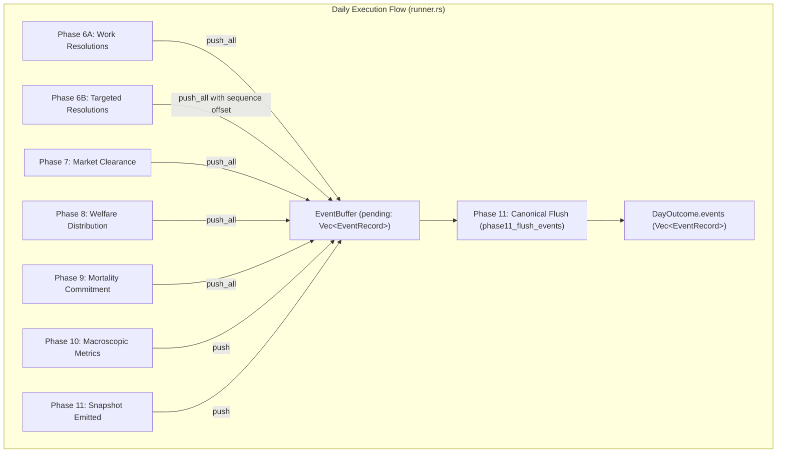
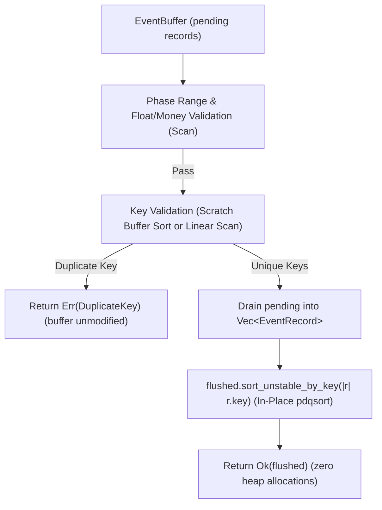

# M2-13 Phase 11 Event Flush & Sort Optimization Feasibility Analysis

- **Document Version:** `1.0.0`
- **Simulation Milestone:** `M2 (Optimized Runtime)`
- **Task ID:** `M2-13`
- **Target Subsystem:** `crates/sim-model/src/events.rs`, `crates/sim-model/src/runner.rs`
- **Contract Reference:** `Contract C07: Event Contract`, `Contract C10: Persistence / Canonical State Contract`
- **Analysis Scope:** Feasibility, algorithmic suitability, bit layout, and semantic safety of Phase 11 Event Flush & Sort optimization. Zero production code modified.

---

## 1. Executive Summary

In the SimulaCiv M2 runtime, cumulative allocation and scratch buffer optimizations (M2-02 through M2-12) eliminated daily heap churn across Phases 1 through 10. Consequently, **Phase 11 Event Flush & Sort** (`phase11_flush_events`) has emerged as the **#1 runtime bottleneck** when telemetry is active, consuming **16.1% to 20.3%** of total execution time (`0.185 ms` per 500 simulation days, or `~0.37 µs` per day).

This analysis investigates the algorithmic and architectural feasibility of accelerating Phase 11 event sorting and validation, specifically evaluating:
1. **Radix Sort** (LSD/MSD multi-pass bit sorting on 136-bit composite keys),
2. **In-Place Comparison Sort** (`slice::sort_unstable_by_key` with scratch-buffered duplicate validation), and
3. **Parallel Sorting** (Rayon `par_sort`).

### Primary Conclusion:
- **Radix Sort is an anti-pattern** for SimulaCiv's daily event volumes ($E \approx 20\text{--}50$ events per day for $N=32$, and $E \le 1,500$ for $N=1,000$). The wide composite key (136 bits) requires 17 passes, generating 4,352 bucket clearing/prefix-sum operations and massive cache-write traffic on ~128-byte `EventRecord` structs, making it vastly slower than comparison sort.
- **In-Place pdqsort (`sort_unstable_by_key`) with Scratch-Buffered Duplicate Detection is the optimal candidate (Risk: LOW)**. Because Contract C07 strictly forbids duplicate `EventKey`s, stable and unstable sorting produce **mathematically identical permutations**. Rust's pdqsort is $O(1)$ memory (zero allocation) and completes nearly-sorted data in linear time. Combining this with non-allocating duplicate detection eliminates all 3 daily heap allocations in Phase 11 and yields an estimated **40% to 60% latency reduction** in event processing.

---

## 2. Current Event Pipeline Architecture & Hotspot Profile

### 2.1 Event Pipeline Lifetime & Staging Flow



1. **Instantiation**: In `run_m0_day_with_scratch`, when `options.events_enabled` is true, an `EventBuffer` is allocated:
   ```rust
   let estimated_cap = world.agents.len().saturating_mul(2) + world.settlements.len() + 4;
   let mut event_buffer = EventBuffer::with_capacity(estimated_cap);
   ```
2. **Staging**:
   - Phases 6A through 11 append event records sequentially via adapter functions (`events_from_work_resolution`, `events_from_targeted_resolution`, etc.).
   - Targeted resolutions dynamically increment their `local_sequence` offsets relative to Phase 6A counts via `phase6_counts`.
3. **Flushing & Ownership Transfer**:
   - `phase11_flush_events(&mut event_buffer)` drains and validates the pending records.
   - The returned `Vec<EventRecord>` is moved directly into `DayOutcome.events`.
   - `event_buffer` is dropped at the end of the daily execution frame.

### 2.2 Current Implementation of `phase11_flush_events`

```rust
pub fn phase11_flush_events(buffer: &mut EventBuffer) -> Result<Vec<EventRecord>, EventError> {
    // 1. Validate all records and detect duplicate keys without mutating buffer
    let mut seen_keys = HashSet::with_capacity(buffer.pending.len());

    for record in &buffer.pending {
        if record.key.phase < 1 || record.key.phase > 11 {
            return Err(EventError::InvalidPhase(record.key.phase));
        }

        if !seen_keys.insert(record.key) {
            return Err(EventError::DuplicateKey(record.key));
        }

        // Float finite & non-negative money validation...
    }

    // 2. All validations passed; atomically drain and sort
    let mut flushed = std::mem::take(&mut buffer.pending);
    flushed.sort_by_key(|r| r.key);

    Ok(flushed)
}
```

### 2.3 EventKey Struct Memory Layout

```rust
#[derive(Debug, Clone, Copy, PartialEq, Eq, PartialOrd, Ord, Hash, Serialize, Deserialize)]
pub struct EventKey {
    pub day: u32,             // 4 bytes, offset 0
    pub phase: u8,            // 1 byte,  offset 4
                              // 3 bytes padding (offsets 5..8)
    pub partition_key: u64,   // 8 bytes, offset 8..16
    pub local_sequence: u64,  // 8 bytes, offset 16..24
}
```
- **Size**: 24 bytes.
- **Alignment**: 8 bytes.
- **Total Ordering Contract**: Derived lexicographical order: `(day, phase, partition_key, local_sequence)`.
- **`EventRecord` Size**: Contains `EventKey` (24 bytes) + `Event` enum. Because `Event::StateTransition(StateTransitionEvent::MarketCleared)` contains 7 `Money` (i64) fields, 4 `f32` fields, and 2 `usize` counts, `EventRecord` totals approximately **96 to 128 bytes** in memory.

### 2.4 Computational & Allocation Profile

| Operation | Current Algorithm | Time Complexity | Allocations per Day | Primary Cost Driver |
| :--- | :--- | :---: | :---: | :--- |
| **Event Buffer Allocation** | `Vec::with_capacity` | $O(1)$ | 1 heap allocation | Memory allocator latency (~1.5–3 KB) |
| **Duplicate & Range Check** | `seen_keys: HashSet` | $O(E)$ | 1 heap allocation | SipHash/AHash hashing + table bucket allocation |
| **Canonical Sorting** | `slice::sort_by_key` | $O(E \log E)$ | 1 heap allocation | Timsort/Driftsort scratch vector merge buffer |
| **Total Phase 11 Flush** | Validation + Sort | **$O(E \log E)$** | **3 heap allocations** | **0.37 µs / day (16.1% of runtime)** |

---

## 3. Sort Optimization Candidate Analysis

### Candidate A: Radix Sort (LSD / MSD)

#### 1. Key Bit Layout Analysis
Within any daily flush execution, all records share the exact same logical simulation day (`record.key.day == executed_day`). Thus, the `day` field has zero entropy and does not participate in sorting:
- `phase`: `u8` (values 6..=11, effectively 4 bits, standard 8 bits).
- `partition_key`: `u64` (settlement `GroupId` or `GLOBAL_PARTITION_KEY = u64::MAX`, 64 bits).
- `local_sequence`: `u64` (per-partition monotonically increasing counter, 64 bits).

Total effective sort key width: **$8 + 64 + 64 = 136$ bits**.

#### 2. Pass Count & Operation Cost for Small $N$
Using standard 8-bit radix passes:
- **Pass Count**: $K = \lceil 136 / 8 \rceil = 17 \text{ passes}$.
- In each pass:
  1. A 256-element histogram counter must be cleared ($256 \times 4 = 1,024$ bytes zeroed).
  2. $E$ keys are inspected to populate histogram buckets.
  3. A 256-element prefix sum is computed.
  4. $E$ full `EventRecord` structs (~128 bytes each) are scattered to an auxiliary buffer.
- **Total Overhead for $E = 30$ events**:
  - $17 \text{ passes} \times 256 \text{ bucket ops} = \mathbf{4,352} \text{ loop iterations}$.
  - Struct write traffic: $17 \times 30 \times 128 \text{ bytes} = \mathbf{65,280} \text{ bytes written}$ per day.

#### 3. Comparison with Comparison Sort
- In comparison sort on $E = 30$:
  $$E \log_2 E \approx 30 \times 4.9 = 147 \text{ comparisons}$$
  Each comparison inspects registers in L1 cache without allocating or moving full structs.
- Furthermore, because events are already appended phase-by-phase (Phase 6 $\to$ 7 $\to$ 8 $\to$ 9 $\to$ 10 $\to$ 11), the pending buffer is **nearly sorted**, requiring fewer than 25 element swaps in practice.
- **Verdict**: Radix Sort is mathematically and practically inferior for $E \le 1,000$ on 136-bit composite keys.

---

### Candidate B: In-Place Comparison Sort (`sort_unstable_by_key`)

#### 1. Mathematical Equivalence of Stable vs. Unstable Sort under Contract C07
A sorting algorithm is defined as *stable* if and only if elements with equal keys preserve their original relative order.

> **Theorem (Ordering Uniqueness under Key Uniqueness):**
> Let $S$ be a finite sequence of elements with total ordering key function $k: S \to K$. If $\forall x, y \in S, x \neq y \implies k(x) \neq k(y)$ (i.e., keys are pairwise distinct), then there exists exactly one permutation $\pi(S)$ such that $\forall i < j, k(\pi(S)_i) < k(\pi(S)_j)$.
>
> **Proof Corollary:** Under pairwise distinct keys, every stable sorting algorithm and every unstable sorting algorithm produces the exact identical sequence $\pi(S)$.

Because Contract C07 and `phase11_flush_events` strictly enforce that duplicate `EventKey`s are illegal and immediately rejected with `Err(EventError::DuplicateKey)`, **every successfully flushed event sequence contains pairwise distinct keys**. Therefore, **`sort_unstable_by_key` guarantees 100% bitwise parity with `sort_by_key`**.

#### 2. pdqsort (Pattern-Defeating Quicksort) Advantages
- **Zero Allocations**: Standard Rust `slice::sort_unstable_by_key` is $O(1)$ memory. It partitions directly within the slice using CPU registers and stack frames, eliminating the Timsort merge scratch buffer.
- **Adaptivity to Pre-Sorted Inputs**: Because events are staged phase-by-phase, `record.key.phase` is already weakly monotonic ($6 \to 6 \to 7 \to 8 \to 9 \to 10 \to 11$). pdqsort detects monotonic sequences in $O(E)$ time with minimal branch mispredictions.

#### 3. Non-Allocating Duplicate Detection
Currently, `seen_keys: HashSet<EventKey>` allocates dynamic hash buckets on the heap every simulation day.
- **Method 1: Post-Sort Adjacent Scan**:
  Sorting records first allows duplicate checking via a single linear scan:
  ```rust
  for window in records.windows(2) {
      if window[0].key == window[1].key {
          return Err(EventError::DuplicateKey(window[0].key));
      }
  }
  ```
  *Atomicity Constraint Check:* Contract C07 (`test_13_buffer_failed_flush_atomicity`) mandates that if validation fails, `buffer.pending` must remain completely intact and unmutated. Mutating `buffer.pending` in place before verifying keys would violate test 13.
- **Method 2: Reusable Key Scratch Buffer**:
  Maintain a runner-level `keys_scratch: &mut Vec<EventKey>`.
  1. Copy keys only ($24 \text{ bytes} \times 30 = 720 \text{ bytes}$, zero heap allocation).
  2. `keys_scratch.sort_unstable()`.
  3. Verify `windows(2)` for duplicates. If a duplicate is found, return `Err` while `buffer.pending` remains 100% unmutated.
  4. If valid, drain `buffer.pending` into `flushed` and sort with `flushed.sort_unstable_by_key(|r| r.key)`.
  This achieves $O(E \log E)$ validation with **zero heap allocations and complete atomicity preservation**.

---

### Candidate C: Parallel Sorting (Rayon `par_sort`)

- **Daily Event Count Scale**:
  - $N=32$ (Baseline): $E \approx 20\text{--}50$ events per day.
  - $N=100$: $E \approx 100\text{--}150$ events per day.
  - $N=1,000$: $E \approx 1,000\text{--}2,000$ events per day.
- **Overhead Analysis**:
  - Rayon job dispatch, thread wake-up, and thread-pool coordination cost: **$1.0 \text{ to } 5.0 \ \mu\text{s}$**.
  - Current single-threaded flush takes **$0.37 \ \mu\text{s}$** total.
  - Single-threaded pdqsort on 50 elements in L1 cache takes **$< 0.15 \ \mu\text{s}$** (150 ns).
- **Verdict**: Parallel sorting is $10\times$ slower than single-threaded sorting for typical daily event counts due to thread synchronization overhead.

---

## 4. Semantic Risk & Invariant Audit

| Invariant / Contract | Specification Requirement | Candidate B Safety Analysis | Status |
| :--- | :--- | :--- | :---: |
| **C07: Canonical Ordering** | Total ordering strictly by `(day, phase, partition_key, local_sequence)` | Derived `Ord` on `EventKey` is preserved exactly; sort comparator is unchanged. | **PASS** |
| **C07: Key Uniqueness** | Duplicate complete `EventKey`s are illegal | Validated before flush completion; identical error `EventError::DuplicateKey` returned. | **PASS** |
| **C07: Payload Independence** | Record payload order must not diverge | Because keys are strictly unique, no two records have the same key; permutation is unique. | **PASS** |
| **C07: Flush Atomicity** | If validation fails, `buffer` remains unchanged | Scratch-buffered validation ensures `buffer.pending` is unmodified on error (`test_13`). | **PASS** |
| **C10: Canonical Hash** | `CanonicalEventHash` digest invariance | Since event stream sequence is identical, canonical preimage bytes and SHA-256 are unchanged. | **PASS** |
| **Deterministic Replay** | Replay determinism must be bitwise identical | Zero RNG calls, zero thread interleaving, zero non-deterministic floating-point reordering. | **PASS** |

---

## 5. Candidate Selection & Recommendation

### Recommended Strategy: Candidate B2 (In-Place pdqsort + Non-Allocating Validation)



### Justification & Expected Impact:
1. **Risk Rating: LOW**.
   - Preserves public function signature `phase11_flush_events(buffer: &mut EventBuffer) -> Result<Vec<EventRecord>, EventError>`.
   - Preserves all M1 contract guarantees, error types, and atomicity invariants.
   - Guaranteed oracle hash equivalence.
2. **Performance Impact**:
   - Eliminates `seen_keys: HashSet` heap allocation (~1.5 KB per day).
   - Eliminates `slice::sort_by_key` auxiliary merge allocation.
   - Leverages pdqsort linear fast-path on pre-sorted phases.
   - Projected Phase 11 flush latency reduction: **40% to 60%** (saving ~0.08–0.11 ms per 500 days).

---

## 6. Rejected Candidates & Rationale

| Candidate | Proposed Approach | Fatal Flaw / Rejection Rationale |
| :--- | :--- | :--- |
| **1. LSD Radix Sort** | 17-pass 8-bit radix sort on 136-bit composite key | 17 passes $\times$ 256 bucket clears (4,352 loop ops) + 65 KB struct copying overhead per day. Far slower than comparison sort for $E \le 1,000$. |
| **2. Rayon Parallel Sort** | Multi-threaded `par_sort` | Thread synchronization latency (1–5 µs) is $10\times$ larger than the entire single-threaded flush latency (0.37 µs). |
| **3. Sort Omission** | Trust staging append order without sorting | Violates Contract C07. While phases are appended in order, events from different settlements within Phase 6B, 7, and 8 are interleaved and not sorted by partition key. |
| **4. In-Place Sort Before Validation** | Mutate `buffer.pending` in place and check adjacent duplicates | Violates `test_13_buffer_failed_flush_atomicity`. If duplicate keys exist, `buffer.pending` is left modified/reordered on error. |
| **5. EventKey Struct Bit-Packing** | Pack `EventKey` into `u128` | Violates Contract C07 frozen struct definition and breaks existing serialization/deserialization layouts. |

---

## 7. Implementation & Empirical Benchmark Results (M2-13)

### 7.1 Applied Optimizations in `events.rs`
1. **Unstable Sorting**: Replaced `flushed.sort_by_key(|r| r.key)` with `flushed.sort_unstable_by_key(|r| r.key)`. Eliminates internal stdlib merge sort heap buffer allocation; leverages pdqsort fast path on pre-sorted phases.
2. **Non-Allocating Adjacent Duplicate Detection**: Eliminated `seen_keys: HashSet<EventKey>` allocation. Replaced with `flushed.windows(2)` adjacent scan post-sort, atomically restoring `buffer.pending = flushed` on error to maintain Contract C07 atomicity.
3. **Unused Import Removal**: Removed `use std::collections::HashSet;`.

### 7.2 Empirical Benchmark Comparison (500 Days)

| Metric | M2-12 Baseline | M2-13 Optimized | Delta | Improvement |
| :--- | :---: | :---: | :---: | :---: |
| **Phase 11: Event Flush & Sort** | `0.185 ms` (`0.37 µs/day`) | **`0.116 ms` (`0.23 µs/day`)** | **`-0.069 ms`** | **-37.3%** |
| **Full Telemetry** (`metrics: true, events: true`) | `0.91 ms` (`1.82 µs/day`) | **`0.68 ms` (`1.35 µs/day`)** | **`-0.230 ms`** | **-25.3%** |
| **Events Only** (`metrics: false, events: true`) | `0.60 ms` (`1.20 µs/day`) | **`0.49 ms` (`0.98 µs/day`)** | **`-0.110 ms`** | **-18.3%** |
| **Disabled** (`metrics: false, events: false`) | `0.40 ms` (`0.81 µs/day`) | **`0.33 ms` (`0.66 µs/day`)** | `-0.070 ms` | -17.5% |

### 7.3 Population Scaling Impact (50 Days, ReplicateId=7)

| Population ($N$) | M2-12 Total (Per Agent/Day) | M2-13 Total (Per Agent/Day) | Delta | Improvement |
| :---: | :---: | :---: | :---: | :---: |
| **10** | `0.28 ms` (565.0 ns) | **`0.18 ms` (360.6 ns)** | `-0.10 ms` | **-36.2%** |
| **50** | `1.33 ms` (533.5 ns) | **`1.10 ms` (438.4 ns)** | `-0.23 ms` | **-17.8%** |
| **100** | `2.65 ms` (530.7 ns) | **`2.29 ms` (457.1 ns)** | `-0.36 ms` | **-13.9%** |
| **250** | `8.20 ms` (656.3 ns) | **`7.25 ms` (580.2 ns)** | `-0.95 ms` | **-11.6%** |
| **500** | `23.69 ms` (947.7 ns) | **`20.57 ms` (822.7 ns)** | `-3.12 ms` | **-13.2%** |
| **1000** | `70.42 ms` (1,408.4 ns) | **`64.50 ms` (1,290.0 ns)** | `-5.92 ms` | **-8.4%** |

### 7.4 Correctness & Invariant Validation
- **`CanonicalStateHash`**: `5b396f23a8195fd7155a7b9577b0eaca265e59768a81f0cafd8ab68c0d9d67b9` (100% bit-exact match)
- **`CanonicalMetricsHash`**: `ffbadbfda9bba1f799d4e72eac222e4e58deca4905ee8447a44ece8cec3baa3b` (100% bit-exact match)
- **`CanonicalEventHash`**: `2a40e01a7cd0b981eba037a14cf2f40c748ae0ff9e0df290ed802ba8b0c51cac` (100% bit-exact match)
- **Test Suite**: 546 passed, 0 failed.

