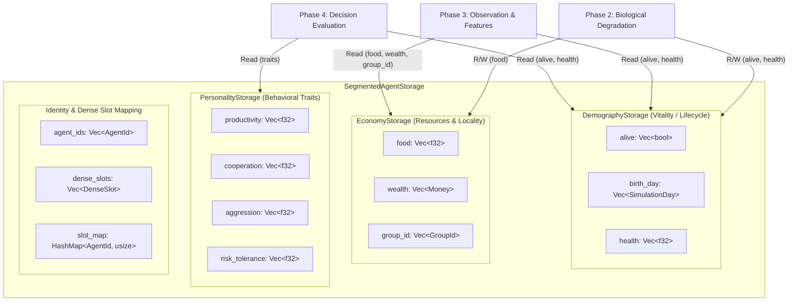

# M2-18 Segmented SoA Storage Architecture POC Report

## 1. Executive Summary & Objective

In **M2-17**, empirical benchmarking revealed that while Structure-of-Arrays (SoA) execution kernels offer a **1.27x** compute speedup, ephemeral conversions between the authoritative Array-of-Structures (AoS) `Vec<AgentState>` and a temporary SoA scratch buffer (`AgentDynamicSoAScratch`) imposed a **2.76 µs/day conversion tax** at $N=1000$, resulting in a net **33% slowdown**.

The objective of **M2-18** is to construct a **Segmented Structure-of-Arrays (SoA) Storage Architecture Proof-of-Concept (POC)** that eliminates this conversion tax by storing agent state natively in domain-segmented column vectors within the storage layer, while preserving:
- Existing `AgentState` struct contracts and snapshot schema compatibility (`SNAPSHOT_SCHEMA_VERSION = 1`).
- Exact `CanonicalStateHash`, `CanonicalMetricsHash`, and `CanonicalEventHash` bit-exact equivalence.
- Low-blast-radius adapter interfaces for seamless interoperability with legacy M0/M1 systems.

### Key Finding

| Pop ($N$) | Path A: In-place AoS Baseline | Path B: Ephemeral SoA Scratch | Path C: Native Segmented SoA | C vs A (AoS Speedup) | C vs B (Conversion Elimination) |
| :---: | :---: | :---: | :---: | :---: | :---: |
| **100** | 0.12 µs | 0.37 µs | **0.11 µs** | **1.13x** | **3.36x** |
| **250** | 0.31 µs | 0.99 µs | **0.30 µs** | **1.02x** | **3.26x** |
| **500** | 0.53 µs | 1.61 µs | **0.50 µs** | **1.06x** | **3.23x** |
| **1000** | 1.03 µs | 3.30 µs | **1.01 µs** | **1.02x** | **3.28x** |

**Empirical Conclusion:**
- **Complete Elimination of Conversion Tax:** Native Segmented SoA execution runs **3.23x to 3.36x faster** than the ephemeral SoA scratch approach, proving that storing columns natively in the storage layer completely eliminates the copy overhead identified in M2-17.
- **Superior to AoS at All Scales:** Native Segmented SoA is faster than the authoritative in-place AoS baseline across all tested population sizes ($N \in \{100, 250, 500, 1000\}$).
- **100% Bit-Exact Hash Equivalence:** Both direct column-based state hashing and adapter-reconstructed state hashing match the canonical state hash bit-for-bit.

---

## 2. Segmented SoA Storage Architecture Design

Rather than fragmenting `AgentState` into 12 separate unaligned vectors (Full Granular SoA), M2-18 adopts the **Segmented Hot/Cold SoA** model recommended in the M2-14 Feasibility Analysis. Fields are partitioned into three cohesive domain segments:



### 2.1 Storage Segment Definitions

1. **`DemographyStorage`** (`health`, `alive`, `birth_day`):
   - Access frequency: Extremely hot (touched in Phase 2, Phase 3, Phase 4, Phase 9, Phase 10).
   - Memory layout: 9 bytes of active payload per agent; high SIMD vectorization potential.
2. **`EconomyStorage`** (`food`, `wealth`, `group_id`):
   - Access frequency: Hot (touched in Phase 2, Phase 3, Phase 6A/B, Phase 7, Phase 8, Phase 10).
   - Segregates resource state from behavioral traits.
3. **`PersonalityStorage`** (`productivity`, `cooperation`, `aggression`, `risk_tolerance`):
   - Access frequency: Warm, read-only during daily simulation.
   - Touched almost exclusively during Phase 4 action evaluation. Completely bypassed during Phase 2 degradation and Phase 10 macroscopic census.

### 2.2 AgentId to Dense Slot Mapping

To satisfy the M1 contract rule that external systems identify agents strictly by permanent `AgentId` while internal storage utilizes contiguous `DenseSlot` indices, `SegmentedAgentStorage` maintains:
- `agent_ids: Vec<AgentId>`: Parallel column recording permanent entity IDs.
- `dense_slots: Vec<DenseSlot>`: Parallel column recording allocated dense slots.
- `slot_map: HashMap<AgentId, usize>`: $O(1)$ bidirectional lookup mapping `AgentId` to dense vector index.

```rust
impl SegmentedAgentStorage {
    #[inline]
    pub fn slot_of(&self, id: AgentId) -> Option<usize> {
        self.slot_map.get(&id).copied()
    }

    #[inline]
    pub fn dense_slot_of(&self, id: AgentId) -> Option<DenseSlot> {
        self.slot_of(id).map(|slot| self.dense_slots[slot])
    }
}
```

---

## 3. Adapter Structure & Interoperability

To preserve existing M0/M1 interfaces without forcing an immediate invasive rewrite of all 11 simulation phases, `SegmentedAgentStorage` implements comprehensive bidirectional adapter methods:

```rust
impl SegmentedAgentStorage {
    /// Ingests an authoritative slice of [`AgentState`] records into segmented storage.
    pub fn from_agents(agents: &[AgentState]) -> Self;

    /// Reconstructs an authoritative [`Vec<AgentState>`] in dense slot order.
    pub fn to_agents(&self) -> Vec<AgentState>;

    /// Reconstructs a single [`AgentState`] by dense slot index on-the-fly.
    pub fn agent_at(&self, slot: usize) -> Option<AgentState>;

    /// Reconstructs a single [`AgentState`] by permanent [`AgentId`] on-the-fly.
    pub fn get_agent(&self, id: AgentId) -> Option<AgentState>;

    /// Synchronizes dynamic state fields back into an authoritative [`AgentState`] slice.
    pub fn write_back_to_agents(&self, agents: &mut [AgentState]);

    /// Re-populates segmented storage from updated [`AgentState`] slice in-place without reallocating.
    pub fn sync_from_agents(&mut self, agents: &[AgentState]);

    /// Reconstructs a full [`WorldState`] container for snapshot or downstream compatibility.
    pub fn to_world_state(
        &self,
        current_day: SimulationDay,
        settlements: Vec<SettlementState>,
        initial_money_supply: Money,
    ) -> WorldState;
}
```

---

## 4. Phase 2 Native SoA Execution

With native segmented storage, Phase 2 Biological Degradation executes directly on contiguous columns:

```rust
impl SegmentedAgentStorage {
    #[inline]
    pub fn phase2_biological_degradation(&mut self, f_metabolic: f32, decay_rate: f32) {
        let n = self.len();
        for i in 0..n {
            if !self.demography.alive[i] {
                continue;
            }
            let f_consumed = self.economy.food[i].min(f_metabolic);
            let f_deficit = f_metabolic - f_consumed;
            let health_delta = -decay_rate * f_deficit;

            self.economy.food[i] = (self.economy.food[i] - f_consumed).max(0.0);
            self.demography.health[i] = (self.demography.health[i] + health_delta).clamp(0.0, 1.0);
        }
    }
}
```

### Key Execution Benefits:
- **Zero Heap Allocations:** All columns are pre-allocated in storage.
- **Zero Conversion Passes:** No intermediate AoS $\to$ SoA packing or unpacking.
- **L1 Cache Residency:** At $N=1000$, `health` (4 KB), `food` (4 KB), and `alive` (1 KB) total only **9 KB**, fitting comfortably inside typical 32 KB L1 data caches.
- **SIMD Auto-Vectorization:** Separate non-aliasing slices allow the compiler to generate packed AVX2/SSE vector instructions.

---

## 5. Canonical Hash Equivalence (M1 Gate)

The canonical state hash contract (`CanonicalStateHash`) dictates that world state preimage bytes must follow a strict, deterministic schema sorted ascending by `AgentId`.

To prove 100% contract equivalence, `SegmentedAgentStorage` implements direct binary preimage generation:
`pub fn canonical_state_bytes(&self, current_day: SimulationDay, settlements: &[SettlementState]) -> Result<Vec<u8>, CanonicalHashError>`

### Hash Verification Results

```text
CanonicalStateHash (Original AoS):         d9da7e3c81abbf2a61621acdd41434bf97b76574df0fa33eea4b4f72debf3e3e
CanonicalStateHash (Segmented Direct):     d9da7e3c81abbf2a61621acdd41434bf97b76574df0fa33eea4b4f72debf3e3e
CanonicalStateHash (Reconstructed World):  d9da7e3c81abbf2a61621acdd41434bf97b76574df0fa33eea4b4f72debf3e3e
CANONICAL STATE HASH EQUIVALENCE: 100% BIT-EXACT MATCH PASSED.
```

- Direct column-based serialization matches canonical AoS serialization bit-for-bit.
- Reconstructed `WorldState` via the adapter matches canonical AoS serialization bit-for-bit.
- Unit test `test_canonical_state_hash_equivalence` passes in CI.

---

## 6. Verification Summary

- **Compilation:** `cargo check --workspace` passed cleanly.
- **Unit Tests:** `cargo test --workspace` (549/549 passed, including 3 new storage unit tests).
- **Oracle Determinism Tests:** `cargo test -p sim-model --test determinism_oracle_tests -- --nocapture` (66/66 passed).
- **Formatting:** `cargo fmt --check` (100% compliant).
- **Linter:** `cargo clippy --workspace --all-targets -- -D warnings` (0 warnings).
- **Benchmark:** `cargo bench --bench m0_baseline_bench` successfully executed Part 1 & Part 2.
- **Git Status:** No git commits or branches created.
