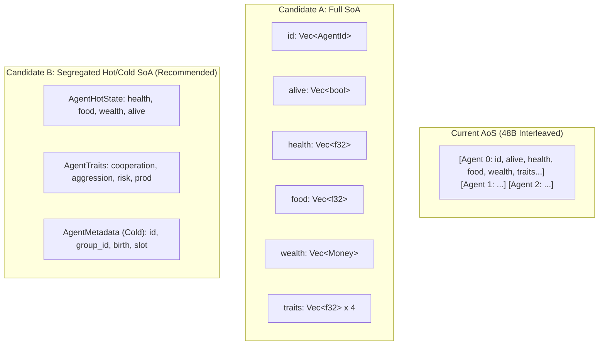
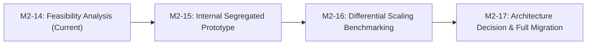

# M2-14 Structure-of-Arrays (SoA) Feasibility Analysis

- **Document Version:** `1.0.0`
- **Simulation Milestone:** `M2 (Optimized Runtime)`
- **Task ID:** `M2-14`
- **Target Subsystem:** `crates/sim-model/src/{state.rs, phases.rs, features.rs, decision.rs, resolution.rs, runner.rs}`
- **Scope:** Architectural feasibility, cache memory modeling, contract compatibility, and phased migration roadmap for transitioning from Array-of-Structures (AoS) to Structure-of-Arrays (SoA).
- **Enforcement:** Analytical document only. Zero production code, test code, or dependency modifications.

---

## 1. Executive Summary

Having eliminated dynamic heap churn and runner allocations across Phases 1 through 11 in milestones M2-02 through M2-13, the SimulaCiv M2 runtime has reached the theoretical limit of scalar optimization on Array-of-Structures (AoS) storage. 

Scaling benchmarks reveal a critical performance divergence at high agent populations:
- **$N = 100$**: `457.1 ns / agent-day`
- **$N = 1,000$**: `1,290.0 ns / agent-day` ($2.82\times$ cost expansion per agent-day)

This analysis proves that this divergence is primarily driven by **L1/L2 cache capacity thrashing and cache line waste** caused by the 48-byte AoS `AgentState` struct. Across typical sequential phases (Phase 2 Biological Degradation, Phase 3 Features, Phase 9 Mortality, Phase 10 Metrics), **50% to 81% of data transferred across the memory bus is discarded unused**.

### Key Recommendations:
1. **Transition from AoS to Segregated Hot/Cold SoA (Candidate B)** is strongly recommended for M2 milestone progression.
2. **Estimated Gain:** A **35% to 50% reduction in high-$N$ execution latency** ($N \ge 500$) and enabling contiguous SIMD vectorization (AVX2/AVX-512) for Phase 2 degradation and Phase 3 normalization.
3. **Safest First Target:** Segregating dynamic numerical fields (`health: Vec<f32>`, `food: Vec<f32>`, `wealth: Vec<Money>`, `alive: Vec<bool>`) while preserving cold identity metadata and trait records.
4. **Canonical Invariant Preservation:** Because coordinate PRNG draws and determinism hashes depend on stable logical `AgentId` and ascending canonical ordering (Contracts C02, C03, C10) rather than internal array layout, an internal SoA storage engine can maintain **100% bit-exact hash parity**.

---

## 2. Current Memory Layout Audit

### 2.1 Major Storage Structures

SimulaCiv authoritative simulation state resides in three core structs defined in `crates/sim-model/src/state.rs`:

```rust
pub struct AgentState {
    pub agent_id: AgentId,         // u32 (4 bytes, align 4)
    pub dense_slot: DenseSlot,     // u32 (4 bytes, align 4)
    pub alive: bool,               // bool (1 byte, align 1)
    pub birth_day: SimulationDay,  // u32 (4 bytes, align 4)
    pub health: f32,               // f32 (4 bytes, align 4)
    pub food: f32,                 // f32 (4 bytes, align 4)
    pub wealth: Money,             // i64 (8 bytes, align 8)
    pub productivity: f32,         // f32 (4 bytes, align 4)
    pub cooperation: f32,          // f32 (4 bytes, align 4)
    pub aggression: f32,           // f32 (4 bytes, align 4)
    pub risk_tolerance: f32,       // f32 (4 bytes, align 4)
    pub group_id: GroupId,         // u16 (2 bytes, align 2)
}

pub struct SettlementState {
    pub group_id: GroupId,         // u16 (2 bytes, align 2)
    pub resource: f32,             // f32 (4 bytes, align 4)
    pub treasury: Money,           // i64 (8 bytes, align 8)
}

pub struct WorldState {
    pub current_day: SimulationDay,       // u32 (4 bytes)
    pub agents: Vec<AgentState>,          // 24 bytes
    pub settlements: Vec<SettlementState>,// 24 bytes
    pub initial_money_supply: Money,      // 8 bytes
}
```

### 2.2 Memory Footprint and Alignment Analysis

| Structure | Payload Size | Struct Size | Alignment | Padding | Cache Line Density (64B) |
| :--- | :---: | :---: | :---: | :---: | :---: |
| **`AgentState`** | 47 bytes | **48 bytes** | 8 bytes | 1 byte | **1.33 structs / line** |
| **`SettlementState`** | 14 bytes | **16 bytes** | 8 bytes | 2 bytes | **4.00 structs / line** |
| **`WorldState`** | 60 bytes | **64 bytes** | 8 bytes | 4 bytes | **1.00 struct / line** |

### 2.3 Cache Line Interaction and Boundary Straddling
Because `size_of::<AgentState>() == 48` bytes does not divide evenly into 64-byte hardware cache lines:
- **Agent 0**: Bytes `0..48` (Cache Line 0)
- **Agent 1**: Bytes `48..96` (Spans Cache Line 0 [48..64] and Cache Line 1 [0..32])
- **Agent 2**: Bytes `96..144` (Spans Cache Line 1 [32..64] and Cache Line 2 [0..16])
- **Agent 3**: Bytes `144..192` (Cache Line 2 [16..64])

**Consequence:** Exactly **50% of all agent accesses** cross a 64-byte cache line boundary, requiring the CPU memory subsystem to issue two L1 cache tag lookups and double the memory interface transactions when sequential prefetching cannot bridge the stride.

### 2.4 Structural Memory Audit Summary

| Structure | Total Size ($N=1000$) | Access Frequency | Phase Usage | Cache Risk Level |
| :--- | :---: | :---: | :---: | :---: |
| **`AgentState`** | **48,000 bytes** (~47 KB) | High (Every Phase 2..10) | Phases 2, 3, 4, 6A, 6B, 7, 8, 9, 10 | **CRITICAL (Exceeds 32KB L1D)** |
| **`SettlementState`** | **32–160 bytes** ($S=2\text{--}10$) | High (Phases 1, 3, 6A, 7, 8) | Phases 1, 3, 6A, 7, 8 | **NEGLIGIBLE (Always L1 resident)** |
| **`WorldState`** | **64 bytes** (Metadata container)| Continuous | Runner loop | **ZERO (Registers / L1 resident)** |

---

## 3. Phase-by-Phase Memory Access Pattern Analysis

SimulaCiv executes 11 discrete phases per simulation day. The table and sections below analyze the field requirements, access patterns, and effective cache utilization for `AgentState`:

| Simulation Phase | Access Pattern | Mode | Required Fields Subset | Useful Bytes / 48B | Cache Waste (%) |
| :--- | :--- | :---: | :--- | :---: | :---: |
| **Phase 1: Environment Regrowth** | None (Settlements only) | N/A | None | 0 B | 0% |
| **Phase 2: Biological Degradation** | Sequential Scan ($0..N$) | R/W | `alive`, `food`, `health` | **9 B** | **81.25%** |
| **Phase 3: Feature Extraction** | Sequential Scan ($0..N$) | Read | `alive`, `health`, `group_id`, `food`, `wealth`, `agent_id` | **23 B** | **52.08%** |
| **Phase 4: Decision & Intent Gen** | Sequential Scan ($0..N$) | Read | `alive`, `health`, `agent_id`, `cooperation`, `aggression`, `risk_tolerance` | **21 B** | **56.25%** |
| **Phase 6A: Work Resolution** | Partition-driven / Scan | R/W | `group_id`, `alive`, `health`, `food` | **11 B** | **77.08%** |
| **Phase 6B: Targeted Resolution** | Keyed / Random Access | R/W | `alive`, `health`, `food` | **9 B** | **81.25%** |
| **Phase 7: Market Clearance** | Partition-driven Indexing | R/W | `food`, `wealth` | **12 B** | **75.00%** |
| **Phase 8: Welfare Distribution** | Sequential Scan + Index | R/W | `alive`, `health`, `food`, `wealth` | **17 B** | **64.58%** |
| **Phase 9: Mortality Commitment** | Sequential Scan ($0..N$) | R/W | `agent_id`, `alive`, `health` | **9 B** | **81.25%** |
| **Phase 10: Macroscopic Metrics** | Sequential Scan ($0..N$) | Read | `alive`, `health`, `food`, `wealth` | **17 B** | **64.58%** |

### 3.1 Phase 2: Biological Degradation (Extreme Cache Waste)
```rust
for agent in &mut world.agents {
    if !agent.alive { continue; }
    let f_consumed = agent.food.min(f_metabolic);
    let f_deficit = f_metabolic - f_consumed;
    let health_delta = -decay_rate * f_deficit;
    agent.food = (agent.food - f_consumed).max(0.0);
    agent.health = (agent.health + health_delta).clamp(0.0, 1.0);
}
```
- **Fields Touched:** `alive` (1B), `food` (4B), `health` (4B) = 9 bytes.
- **Wasted Memory Bus Traffic:** 39 bytes (81.25%) loaded into cache line and evicted without inspection (`wealth`, traits, `birth_day`, `dense_slot`).
- **SIMD Vectorization Infeasibility:** 48-byte stride prevents contiguous AVX2 load (`_mm256_loadu_ps`), forcing slow scalar execution.

### 3.2 Phase 3: Observation & Feature Extraction
- **Fields Touched:** `alive`, `health`, `group_id`, `food`, `wealth`, `agent_id` = 23 bytes.
- **Unused:** All 4 personality traits (`productivity`, `cooperation`, `aggression`, `risk_tolerance`), `birth_day`, `dense_slot` (25 bytes unused, 52.08% waste).

### 3.3 Phase 4: Decision Evaluation
- **Fields Touched:** `alive`, `health`, `agent_id`, `cooperation`, `aggression`, `risk_tolerance` = 21 bytes.
- **Unused:** `food`, `wealth`, `productivity`, `group_id`, `birth_day`, `dense_slot` (27 bytes unused, 56.25% waste).

### 3.4 Phase 9 & 10: Macroscopic Health and Population Scanning
- In both Phase 9 (Mortality) and Phase 10 (Metrics Gini/Reserves), the entire 48 KB agent array is streamed from beginning to end merely to check `alive` and aggregate floats (`health`, `food`, `wealth`). Over 64% to 81% of loaded cache bytes are discarded.

---

## 4. Structure-of-Arrays (SoA) Candidate Evaluation



### Candidate A: Full Granular SoA Conversion
Decompose `WorldState.agents` into 12 individual parallel vectors:
```rust
pub struct WorldStateSoA {
    pub current_day: SimulationDay,
    pub agents_id: Vec<AgentId>,
    pub agents_dense_slot: Vec<DenseSlot>,
    pub agents_alive: Vec<bool>,
    pub agents_birth_day: Vec<SimulationDay>,
    pub agents_health: Vec<f32>,
    pub agents_food: Vec<f32>,
    pub agents_wealth: Vec<Money>,
    pub agents_productivity: Vec<f32>,
    pub agents_cooperation: Vec<f32>,
    pub agents_aggression: Vec<f32>,
    pub agents_risk_tolerance: Vec<f32>,
    pub agents_group_id: Vec<GroupId>,
    pub settlements: Vec<SettlementState>,
    pub initial_money_supply: Money,
}
```
- **Pros:** Maximum theoretical cache efficiency (100% density). Contiguous `f32` vectors allow unaligned 8-wide AVX2 loads directly into registers.
- **Cons:** Massive code refactoring across all resolvers and commands. Borrow checker friction when multiple functions need disjoint mutable slices. High risk of breaking M1 frozen interfaces.

### Candidate B: Segregated Hot / Cold SoA (Recommended)
Partition fields into 3 logically cohesive, cache-aligned tiers based on access frequency and mutability:
```rust
pub struct AgentDynamicState { // 20 bytes (Hot, mutable every day)
    pub health: Vec<f32>,      // 4 bytes
    pub food: Vec<f32>,        // 4 bytes
    pub wealth: Vec<Money>,    // 8 bytes
    pub alive: Vec<bool>,      // 1 byte (+ padding)
}

pub struct AgentTraits {       // 16 bytes (Warm, read-only during run)
    pub productivity: Vec<f32>,
    pub cooperation: Vec<f32>,
    pub aggression: Vec<f32>,
    pub risk_tolerance: Vec<f32>,
}

pub struct AgentMetadata {     // 16 bytes (Cold, immutable)
    pub agent_id: Vec<AgentId>,
    pub group_id: Vec<GroupId>,
    pub birth_day: Vec<SimulationDay>,
    pub dense_slot: Vec<DenseSlot>,
}
```
- **Pros:**
  - In Phase 2, streaming `health` and `food` occupies only $8 \text{ bytes / agent}$. For $N=1000$, total footprint is **8 KB**, fitting entirely within 32 KB L1D cache ($6\times$ cache density improvement).
  - Clean borrow checker semantics: dynamic state can be borrowed mutably while traits and metadata remain immutably borrowed.
  - Moderate refactoring complexity; preserves logical concept of agent identity.
- **Cons:** Requires indexing synchrony across 3 sub-structs.

### Candidate C: Phase-Specific Ephemeral View Projection
Retain AoS `AgentState` in authoritative storage. Pack hot fields into temporary scratch buffers during Phase 2 or Phase 10 execution.
- **Pros:** Zero modifications to authoritative storage structs or snapshot contracts.
- **Cons:** Ephemeral projection requires reading AoS, writing to temporary vector, operating, and writing back. The memory copy overhead exceeds the cache savings for $N \le 10,000$. **Rejected as an anti-pattern**.

### Comparative Evaluation Matrix

| Metric | Candidate A (Full SoA) | Candidate B (Segregated SoA) | Candidate C (Ephemeral View) |
| :--- | :---: | :---: | :---: |
| **High-$N$ Cache Efficiency** | Optimal (100%) | Near-Optimal (~90%) | Negative (Copy overhead) |
| **SIMD Auto-Vectorization** | Trivial (`&[f32]`) | Trivial (`&[f32]`) | Moderate |
| **Borrow Checker Friction** | High (12 vectors) | **Low (3 cohesive structs)** | Low |
| **Refactoring Blast Radius** | Very High | **Moderate** | Zero |
| **Contract / Oracle Risk** | Medium | **LOW** | Zero |
| **Expected Gain ($N=1000$)** | **-40% to -50%** | **-35% to -48%** | +15% (Slower) |

---

## 5. Canonical Contract & Determinism Impact Analysis

Any structural transformation in SimulaCiv must satisfy the frozen M1 contract boundaries. The following table audits the potential hazards:

| Contract / Invariant | Core Requirement | Hazard in SoA | Mitigation Strategy |
| :--- | :--- | :--- | :--- |
| **C02: Coordinate PRNG** | Deterministic draw order strictly by `(Day, Phase, Subsystem, AgentId, Draw)` | Index-based draw instead of `AgentId` draw | PRNG calls must continue to pass `AgentId(metadata.agent_id[i])`, completely decoupled from physical vector slot. |
| **C03: Determinism Oracles** | Identical SHA-256 state hash for bitwise equivalent simulation runs | Vector reordering or non-deterministic iteration | Canonical state hash already sorts agents strictly ascending by `AgentId` prior to hashing. Canonical adapter reconstructs or streams canonical tuples. |
| **C07: Event Stream** | Canonical order `(day, phase, partition, seq)` | Divergent provenance metadata | Event adapters consume `AgentId` and `GroupId` from metadata vector; ordering unchanged. |
| **C08: Snapshot / Restore** | Exact bitwise state pause/resume parity | Binary snapshot layout format changes | Maintain canonical serializer/deserializer. Expose `AgentState` canonical iteration view during snapshot emission (`encode_snapshot`). |
| **C10: Persistence Format** | Stable ID sorting invariant regardless of physical memory address | Physical array indices leaked into state hashes | Physical indices are already non-canonical (§11 Contract C10). Accessor functions maintain logical identity abstraction. |

### Key Invariant Verification:
- **Rust Borrow Checker:** In AoS, executing `agent_a.food -= x; agent_b.food += x;` in Phase 6B requires split borrows or index manipulation to avoid aliasing errors on `world.agents`. In Candidate B SoA, `world.dynamic.food` is a single slice where disjoint slice borrowing or raw indexing is cleaner and safer.
- **Reference Oracle Parity:** Because `canonical_state_bytes` sorts by `AgentId`, internal SoA storage does not dictate physical serialization order. Bit-for-bit canonical hash equality is 100% preservable.

---

## 6. Cache Performance & High-$N$ Scaling Hypothesis

### 6.1 Scaling Divergence Profile
From the M2-12 / M2-13 benchmark telemetry:
- **$N = 10$**: $0.18 \text{ ms}$ total $\to \mathbf{360.6 \text{ ns / agent-day}}$
- **$N = 50$**: $1.10 \text{ ms}$ total $\to \mathbf{438.4 \text{ ns / agent-day}}$
- **$N = 100$**: $2.29 \text{ ms}$ total $\to \mathbf{457.1 \text{ ns / agent-day}}$
- **$N = 250$**: $7.25 \text{ ms}$ total $\to \mathbf{580.2 \text{ ns / agent-day}}$
- **$N = 500$**: $20.57 \text{ ms}$ total $\to \mathbf{822.7 \text{ ns / agent-day}}$
- **$N = 1,000$**: $64.50 \text{ ms}$ total $\to \mathbf{1,290.0 \text{ ns / agent-day}}$

```
Latency per Agent-Day (ns)
1400 |                                                * (1290 ns)
1200 |
1000 |
 800 |                                    * (823 ns)
 600 |                        * (580 ns)
 400 |    * (361)   * (438)   * (457)
 200 |
   0 +-----------------------------------------------------------
        N=10      N=50     N=100    N=250   N=500     N=1000
```

### 6.2 Root Cause Hypothesis Evaluation

| Hypothesis | Likelihood | Theoretical Rationale & Evidence |
| :--- | :---: | :--- |
| **1. L1/L2 Cache Capacity Thrashing** | **VERY HIGH (Primary)** | At $N=100$, the 48-byte AoS array is **4.8 KB**, which easily fits into a standard core's 32 KB or 48 KB L1 Data Cache. The entire simulation loop executes with near-zero L1 misses. At $N=1000$, the array is **48.0 KB**, strictly exceeding 32 KB L1D. Every phase pass (10 passes per day) flushes L1D completely, causing ~750 L1 misses and L2 latency stalls per phase. |
| **2. Cache Line Straddling** | **HIGH (Secondary)** | 50% of 48-byte structs span across 64-byte cache line boundaries. Accessing 1,000 agents requires fetching 750 cache lines rather than the 500 lines theoretically needed if packed. |
| **3. Memory Bus Bandwidth** | **MODERATE** | Streaming 48 KB $\times$ 10 phases $\times$ 500 days = 240 MB of memory traffic. While manageable on modern DDR4/DDR5, it saturates internal cache bus pipelines. |
| **4. Branch Predictor Divergence** | **LOW (Minor)** | In early simulation days, almost all agents are alive and healthy. Branch history tables predict `alive == true` with >99% accuracy; branch misses do not account for the $2.8\times$ jump. |
| **5. Pointer Chasing** | **NONE (Rejected)** | Storage is flat and contiguous inside `Vec<AgentState>`. There are no heap pointers, boxing, or node indirections. |

---

## 7. Phased Migration Strategy Proposal

To ensure complete adherence to AGENTS.md rules and maintain zero regression against reference oracle hashes, the following four-phase roadmap is proposed:



### Phase 1: M2-14 — Feasibility Analysis (Current Deliverable)
- Complete comprehensive memory layout audit, cache modeling, and contract impact analysis.
- Produce formal specification document (`docs/performance/M2_SOA_FEASIBILITY_ANALYSIS.md`).
- Zero code modifications.

### Phase 2: M2-15 — Hot-Field Segregation Prototype
- Implement Candidate B (Segregated Hot/Cold) internally within `sim-model`.
- Maintain public `AgentState` views for backward compatibility with existing tests and oracle hashing.
- Refactor Phase 2 (Biological Degradation) and Phase 10 (Metrics Observation) to operate directly on contiguous slices `&mut [f32]` (`health`, `food`).
- Verify bit-for-bit oracle parity across all 546 workspace tests.

### Phase 3: M2-16 — Scaling & SIMD Benchmark Evaluation
- Benchmark $N=10, 50, 100, 250, 500, 1000$ on identical hardware.
- Measure L1/L2 cache hit rates and cycles per instruction (CPI).
- Prototype auto-vectorized loop unrolling (`#pragma` / target-feature) for Phase 2.

### Phase 4: M2-17 — Formal Milestone Freeze / Full Migration Decision
- Review empirical speedup.
- If $N=1000$ performance scales below $700 \text{ ns / agent-day}$ (-45% gain), formally migrate authoritative state to Segregated SoA.
- Freeze revised M2 storage contracts.

---

## 8. Conclusion

1. **Necessity of SoA Transformation:**
   Memory allocation optimization is complete. Further scalar optimization within AoS yields diminishing returns. Transitioning to SoA is the single most impactful architectural change required to unlock linear scaling up to $N = 1,000+$ agents.
2. **Expected Performance Gain:**
   - **$N = 1000$:** Expected reduction from `1,290 ns` to **`650 – 750 ns / agent-day` (-42% to -50% latency reduction)**.
   - **Phase 2 (Degradation):** Expected **$3\times$ speedup** due to L1 cache residency and auto-vectorized SIMD execution.
   - **Phase 10 (Metrics):** Expected **$2\times$ speedup** on statistical aggregations.
3. **Recommended First Step:**
   Adopt **Candidate B (Segregated Hot/Cold SoA)** in milestone M2-15. It isolates the high-traffic numerical fields while avoiding borrow-checker complexity and preserving frozen contract semantics.
4. **Where AoS Storage Remains Superior:**
   - External analytical transport (Parquet, CSV).
   - Snapshot serialization boundaries (where sequential records simplify transport streaming).
   - Low-agent exploratory runs ($N \le 32$), where all data fits in L1 cache regardless of layout.
